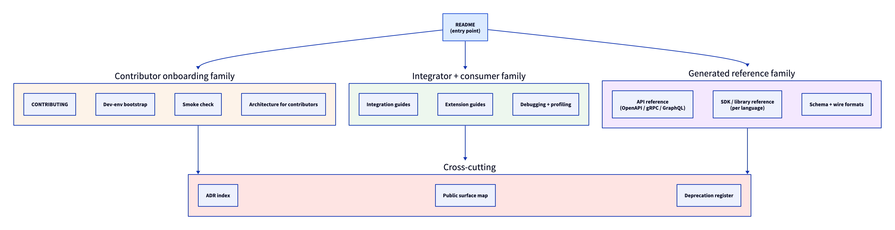
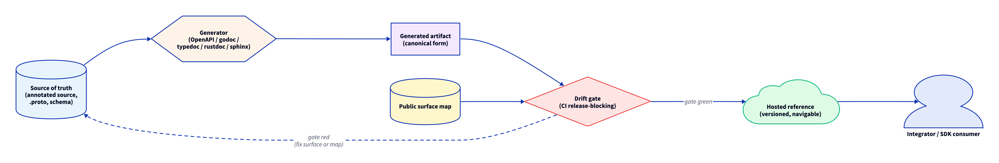
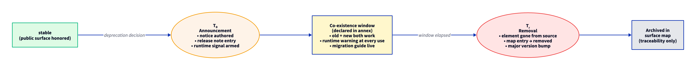

# Stribog Developer Documentation Standard

## 0. TL;DR

Developer documentation is the contract a Stribog project offers to anyone who reads its code, contributes to it, integrates against it, embeds it, or extends it. Every Stribog project that exposes a developer-facing surface — a public API, an SDK, an embedded library, a plugin or extension seam, a contributor-facing codebase — ships developer documentation built to the discipline in this standard. Reference content is generated from source, code samples are tested, public-surface stability is governed, and the developer-doc surface is bound to the same release gate as the rest of the project.

## 0.1 Why This Standard Exists

The [[Stribog Documentation Standard]] governs documentation as architecture, but does not prescribe the engineering discipline behind the developer-facing surface — what the API reference is generated from, how code samples are tested, how public-surface stability is communicated, how deprecation timelines are governed, how an integrator's onboarding path is structured. The [[Stribog User Documentation Standard]] governs documentation aimed at end-users and operators, but is not the right home for the surface that engineers read.

This standard fills that gap. It defines the architecture, generation pipeline, test discipline, stability contract, and release coupling of every developer-facing artifact a Stribog project publishes.

## 0.2 Applicability

This standard binds every Stribog project that:

- exposes a public HTTP, gRPC, MCP, GraphQL, or message-bus surface
- publishes an SDK, library, or client in any language
- ships a binary, container image, or package whose runtime is callable by external code
- defines a plugin, extension, hook, or contract seam for third-party implementers
- accepts contributions from anyone outside the original author set, including future contributors on the same team

A project whose surfaces are entirely internal — used only by its own authors, never extended, never published — declares the scope in the [[Charter Compliance Annex]] and is bound only to §3.1, §3.2, §3.3 (the contributor onboarding family) of this standard.

## 0.3 Definitions

This standard relies on the [[Stribog Glossary]] for cross-cutting terms. Developer-documentation-specific terms used in this document:

- **Public surface:** the set of symbols, endpoints, schemas, flags, environment variables, and behaviors a Stribog project promises to keep stable within its declared compatibility window.
- **Generated reference:** developer reference content produced mechanically from the project source, either at build time, at test time, or in CI, by a tool whose output is the canonical artifact.
- **Drift gate:** a quality gate that fails the build when the generated reference disagrees with the source, when a public surface symbol is undocumented, or when a documented surface symbol no longer exists.
- **Code sample:** a snippet of code, embedded in or referenced from developer documentation, that demonstrates a real call against the public surface. Code samples are first-class testable artifacts.
- **Deprecation notice:** a dated, owned, written record that a public surface element will be removed at or after a stated future date, with a stated migration path.
- **Compatibility window:** the period during which the public surface honors its stability contract. Distinct from the support window for end-users.
- **Contributor onboarding family:** the README, CONTRIBUTING guide, architecture overview, and dev-environment bootstrap documentation that together produce a working contributor in a finite, bounded time.

## 1. Core Positions

The Stribog position on developer documentation is:

1. **Reference is generated, not hand-typed.** Hand-typed developer reference rots. Generated reference can be drift-gated.
2. **Code samples are tested.** A code sample that has never executed is a liability.
3. **The public surface is enumerated.** A project that cannot list its public surface cannot make a stability promise.
4. **Deprecation is a written process, not a sentiment.** Every deprecation has a name, an owner, an announcement date, a removal date, and a migration path.
5. **Onboarding is a finite, measurable journey.** A new contributor reaches a working development loop in a bounded number of steps named in the [[Charter Compliance Annex]].
6. **Developer documentation is bound to the release.** The release gate of §11 of the [[Stribog User Documentation Standard]] applies, with developer-doc-specific clauses added here.
7. **Internal architecture is for contributors.** The contributor-facing architecture document is distinct from the [[Master Reference]] and from any user-facing explanation; it answers what a contributor needs to know to change the system safely.
8. **The Charter Compliance Annex governs project-specific declarations.** Toolchain, generators, sample-test commands, deprecation channel, compatibility window, and contributor onboarding budget are declared per-project.

## 2. Developer Audience Model

A developer-facing document declares the audience it primarily serves. Developer audiences are:

| Tier | Reader | Primary need |
|------|--------|--------------|
| **Contributor** | A developer who will read, change, or add code in this repository. | A working development loop and a clear model of the codebase. |
| **Consumer** | A developer calling the project's public API or SDK from outside the repository. | A stable contract, a working example, and a clear migration story. |
| **Embedder** | A developer linking the project as a library inside their own runtime. | The same as a consumer, plus packaging, versioning, and runtime expectations. |
| **Extender** | A developer implementing the project's plugin, hook, or contract seam. | A precise extension contract, a contract test fixture, and a stability promise. |
| **Operator-developer** | A developer writing code that *operates* the project — Terraform, Helm, custom controllers. | The same as a consumer, plus operational invariants and configuration semantics. |

A document may serve more than one tier, but it names the tiers explicitly. The annex declares the audiences the project actively supports.

## 3. Required Document Families

Every Stribog project bound by this standard publishes the developer-doc families below. Where a family does not apply, the [[Charter Compliance Annex]] declares the exemption and the reason.

### 3.1 Repository README

The README is the entry point. Within a single screen of reading it answers:

- what the project is, in one sentence
- who it is for
- what status it is in (status vocabulary per the [[Stribog Documentation Standard]] §10)
- how to install or run it for the first time
- where to go next — contributor onboarding, integrator quickstart, reference, license

A README that buries the *what* below several screens of badges or that lacks a stated status is non-compliant.

### 3.2 Contributor Onboarding — CONTRIBUTING and Dev-Environment Bootstrap

The contributor onboarding family produces a working contributor in a bounded, named number of steps. It contains:

- a CONTRIBUTING guide naming the change workflow, the review posture, the commit and branch discipline, and the gates a contribution must pass
- a dev-environment bootstrap document naming every prerequisite — runtime versions, toolchain, system dependencies, credentials, machine spec — and a reproducible bootstrap path
- a smoke check the new contributor can run to verify the bootstrap succeeded
- a first-task suggestion or a labeled-issue convention so the new contributor's first change is finite

The [[Charter Compliance Annex]] declares the *onboarding budget* — the maximum number of commands or steps a new contributor follows to reach the smoke check. A project whose bootstrap budget has silently grown beyond the declared figure is non-compliant.

### 3.3 Architecture for Contributors

A document that describes the codebase as a contributor sees it. Distinct from the [[Master Reference]], which describes the system as designed. The contributor architecture covers:

- the layout of the source tree and what each top-level area is for
- the boundaries inside the codebase a contributor must respect — module seams, contract seams, the [[Universal Stribog Engineering Charter]] §3.2 explicit-boundary set
- the build and test entry points
- the places where new contributors most commonly get stuck
- cross-links to the [[Architecture Decision Record (ADR)]] family for the design history

### 3.4 API Reference Contract

The API reference describes every endpoint, method, RPC, or callable surface the project exposes. The API reference is:

- generated from source (OpenAPI, gRPC reflection, GraphQL SDL, typedoc, godoc, rustdoc, sphinx autodoc, or equivalent)
- drift-gated against source on every build per §4
- versioned alongside the product version
- published in a form an integrator can read without cloning the repository

The annex names the generator and the publication target.

### 3.5 SDK and Library Reference

Where the project ships SDKs or libraries, each language target has its own reference. SDK reference is generated by the language-native documentation tool (godoc, rustdoc, sphinx, typedoc, ydoc, javadoc, or equivalent). The annex names the tool per language.

### 3.6 Schema and Wire Format Reference

Where the project defines a schema — JSON Schema, Protobuf, Avro, SQL DDL, configuration grammar — the schema reference is generated from the canonical schema source. Hand-maintained schema documentation is non-compliant.

### 3.7 Integration and Extension Guides

A library of integration and extension guides organised by the integrator's goal:

- *Integration guides* take a consumer or embedder from zero to first successful call, against a real environment
- *Extension guides* take an extender from zero to a working plugin or hook implementation, with the contract test in place

Each guide is owned and bound to a product version range.

### 3.8 Debugging and Profiling Guides

A guide for contributors and embedders on how to observe the project at runtime — log channels, debug flags, profiling endpoints, common failure modes and their telltale traces. Cross-references the operability baseline of the [[Universal Stribog Engineering Charter]] §9.3.

### 3.9 ADR Index

A living index of [[Architecture Decision Record (ADR)]] entries. ADRs are authored from the template at `templates/ADR-Template.md`. The index orders ADRs by number, names their current status (Proposed, Accepted, Superseded, Rejected), and links the superseding relationship explicitly.

### 3.10 Public Surface Map

A single document that enumerates the public surface — every callable, endpoint, flag, environment variable, configuration key, exit code, and schema field the project promises to keep stable. The public surface map is the canonical input to the drift gate of §4.4 and the deprecation gate of §6. A project that cannot point to its public surface map cannot honor a stability contract.

### 3.11 Dev-Doc Layer Diagram

The dev-doc surface is illustrated as a layered architecture in `diagrams/04-dev-doc-layers.png`.

*Developer documentation is organised in layers: the README is the entry, the contributor and integrator onboarding families branch from it, the generated reference layer sits beneath, and the ADR index and public surface map cross-cut the whole.*

### 3.12 Diagram Discipline for Developer Documentation

Developer documentation relies on diagrams to make architecture, protocol flows, deprecation timelines, and extension contracts legible. Diagrams in the developer-doc surface are governed by the rules below in addition to the project-wide [[Stribog Documentation Standard]] §7 diagram standard and the [[Stribog User Documentation Standard]] §6.5 evidence rules.

#### 3.12.1 D2 Is the Default for Developer Docs

Every diagram in the developer-doc surface is authored in D2 using the installed `d2` skill or `d2` CLI. The `.d2` source is the canonical artifact; rendered `.svg` and `.png` outputs are derived. Hand-rolled image-editor exports, screenshots of whiteboard sessions retained as production figures, and ASCII art in prose are non-compliant. Sequence diagrams where D2 is awkward may fall back to Mermaid; the fallback and the diagrams it covers are declared in the [[Charter Compliance Annex]].

#### 3.12.2 Source-Adjacent Layout

Diagrams live under `diagrams/` adjacent to the document that embeds them. Diagram source files carry a numeric prefix that preserves document order, per the [[Stribog Documentation Standard]] §7. The renderer command and the layout engine (`--layout dagre` or `--layout elk` where container dimensions require it) are stable across the repository.

#### 3.12.3 When a Diagram Is Required

The developer-doc surface requires a diagram for, at minimum:

- the contributor architecture document of §3.3 — a top-level component diagram and the explicit-boundary set per the [[Universal Stribog Engineering Charter]] §3.2
- the API reference pipeline of §4 — the generation, drift-gate, and publish flow
- the deprecation timeline of §6.3 — the announce → co-existence → removal arc
- any protocol or wire-format reference that crosses more than one actor — a sequence diagram for the round-trip
- any extension or plugin contract — the contract seam and the relationship between the host and the extender

#### 3.12.4 Generated Diagrams

Where the diagram can be generated from source — a dependency graph from the package manifest, a call-graph from a static analyzer, a schema diagram from a Protobuf or JSON Schema source — generation is preferred over hand authoring, and the generator is named in the annex. Generated diagrams sit alongside hand-authored D2 diagrams under `diagrams/` and are subject to the same drift gate as the rest of the generated reference per §4.4.

#### 3.12.5 Diagrams Are Reviewed in Source

Diagram changes are reviewed at the `.d2` source layer in the same pull request that changes the corresponding documentation prose. A rendered output committed without a source change is non-compliant. A pull request that changes the surface a diagram depicts without updating the diagram is non-compliant.

#### 3.12.6 Accessibility

Developer-doc diagrams carry alt text and, where they convey information beyond decoration, an accessible prose summary. The [[Stribog User Documentation Standard]] §8.4 accessibility floor applies to the developer-doc surface.

## 4. API Reference Discipline

### 4.1 Generation Is the Default

API reference is generated from source. The generator is named in the [[Charter Compliance Annex]] and is invoked by a stable command in the repository's command surface (the [[Universal Stribog Engineering Charter]] §5.10).

### 4.2 Reproducibility

The generation command is reproducible. The same source produces the same generated artifact bit-for-bit, or, where the tool emits non-determinism (timestamps, ordering), the artifact is post-processed to a canonical form. Non-reproducible reference is non-compliant.

### 4.3 Hosted Form

Generated reference is published in a hosted, navigable form. The hosting target is named in the annex. A reference that lives only as a CLI invocation a reader has to run themselves is non-compliant where the project ships to external consumers.

### 4.4 Drift Gate

The repository runs a drift gate on every CI run:

- every public surface element is documented in the generated reference
- every documented surface element exists in the source
- the public surface map of §3.10 enumerates each documented surface element

The drift gate is a binding gate under the [[Universal Stribog Engineering Charter]] §5.9. A red drift gate blocks the release.

The generation and gating pipeline is illustrated in `diagrams/05-api-ref-pipeline.png`.

*The pipeline runs from source through the generator, through the drift gate against the public surface map, into the hosted reference target. Every release passes the gate.*

### 4.5 Per-Version Reference

For projects on a versioned release model, the hosted reference offers one rendering per supported product version. A reader on version *N* reads the reference for version *N*. A single rendering that mixes versions is non-compliant.

For projects on a rolling delivery model, the hosted reference matches the deployed state, and the deployment carries the revision identifier.

## 5. Code Sample Discipline

### 5.1 Samples Are Tested

Every code sample in the developer documentation surface is tested. The test runs the sample against the real public surface or a contract test fixture and verifies the documented outcome. The annex names the sample-test command, which is part of the repository command surface.

### 5.2 Samples Are Versioned

A sample is bound to a product version range. A sample whose version range is older than the current supported set is either updated or sunset.

### 5.3 Samples Are Owned

Every sample has a named owner. A sample inherits the ownership of the document it is embedded in unless it declares its own owner.

### 5.4 Samples Avoid Sensitive Inputs

Samples do not embed real credentials, real customer data, or real internal hostnames. Where a sample requires identifiers, it uses safe fixture values declared in the annex.

### 5.5 Samples Are Self-Contained or Honest

A sample is either runnable as written, or it states explicitly which preconditions it omits. A sample that *appears* runnable but silently depends on an undocumented precondition is non-compliant.

## 6. Public Surface Stability and Deprecation

### 6.1 Stability Posture per Surface Element

Each element of the public surface declares its stability posture in the public surface map:

| Posture | Meaning |
|---------|---------|
| `stable` | Honored within the declared compatibility window. Breaking changes require deprecation. |
| `beta` | Subject to change. Breaking changes are announced but not subject to the full deprecation timeline. |
| `experimental` | May change or be withdrawn at any time. Consumers use at their own risk. |
| `internal` | Not part of the public surface; consumers must not call this. |
| `deprecated` | Scheduled for removal; carries the deprecation notice. |
| `removed` | No longer available; the entry remains in the map for traceability. |

A surface element with no declared posture defaults to `internal`. A consumer who relies on an `internal` element is not protected by the stability contract.

### 6.2 Deprecation Notice Contract

Every deprecation carries a written notice. The notice contains:

- the deprecated surface element, by fully-qualified name
- the date of announcement
- the date of intended removal
- the migration path — the new surface element, the new pattern, or the named alternative
- the owner of record
- the release in which the deprecation was announced
- any operational guidance (logs to expect, runtime warnings emitted, header annotations)

Deprecation notices are collected in a single, dated register in the developer-doc source tree.

### 6.3 Deprecation Timeline

The minimum deprecation timeline for a `stable` surface element is declared in the annex. The timeline is enforced. A removal earlier than the declared timeline allows is a breaking change and requires a major version bump under the [[Universal Stribog Engineering Charter]] §7.4 release semantics.

The timeline is illustrated in `diagrams/06-deprecation-timeline.png`.

*A deprecation runs from announcement, through a window of co-existence in which the old and new surfaces both work, into removal. The window length is declared per project in the Charter Compliance Annex.*

### 6.4 Runtime Signals

Where the runtime supports it, a deprecated element emits a runtime signal — a header, a log line, a metric, a CLI warning — at every use. Silent deprecation is non-compliant.

### 6.5 Communication Path

Deprecation announcements reach the consumer audience through a declared channel — the release notes, a developer newsletter, a status page — named in the annex. A deprecation that is announced only in source code or only in the surface map and never reaches consumers is non-compliant.

## 7. Versioned Documentation

### 7.1 Doc Version Tracks Product Version

The developer documentation surface carries a version that matches the product version it documents. A consumer on product version *N* reads the documentation for *N*.

### 7.2 Multiple Versions Coexist

The hosted developer-doc surface keeps the documentation for the currently-supported product version set live in parallel. A version that has aged out of the support window is archived but remains reachable.

### 7.3 Migration Documents Cross Versions

For each major version transition, a migration document names every breaking change, every deprecation that became a removal, and the consumer-facing path from the prior version to the new one. The migration document is part of the developer-doc gate of §10.1 for the major release.

## 8. Dev-Doc Toolchain Declaration

The [[Charter Compliance Annex]] declares the developer-doc toolchain:

- the API reference generator(s)
- the SDK reference generator(s) per language
- the schema documentation generator(s)
- the sample-test runner
- the drift-gate command
- the hosting target and publication command
- the public surface map location
- the deprecation register location
- the contributor onboarding budget

A toolchain item that exists in the repository but is not declared in the annex is non-compliant. A toolchain item that is declared in the annex but absent from the repository is non-compliant.

## 9. Cross-References to the Engineering Charter

Developer documentation does not redefine engineering discipline. It inherits and cross-links to:

- the testing discipline of the [[Universal Stribog Engineering Charter]] §5
- the architecture discipline of the [[Universal Stribog Engineering Charter]] §3
- the git, CI, and release discipline of the [[Universal Stribog Engineering Charter]] §7
- the operability baseline of the [[Universal Stribog Engineering Charter]] §9.3
- the [[Stribog Security Posture Standard]] for any developer-doc clause that touches credential handling, vulnerability disclosure, or supply-chain integrity

A developer document that restates engineering rules instead of linking to them is non-compliant; the canonical record drifts when restated.

## 10. Developer Documentation Definition of Done

A developer-doc artifact is done when:

- it declares its audience tier(s)
- it carries the generated content where this standard requires generation
- it passes the drift gate of §4.4 where it depends on generated reference
- it carries tested, versioned, owned code samples per §5
- its public surface map entries (if any) declare a stability posture per §6.1
- any deprecation it documents carries a complete §6.2 notice
- it cross-links to the [[Architecture Decision Record (ADR)]] family for the underlying design history
- its `status` and `last_updated` fields conform to the [[Stribog Documentation Standard]] §10 and §11
- it is reachable from the project's developer-doc entry point in at most two clicks
- it conforms to the accessibility bar of the [[Stribog User Documentation Standard]] §8.4

A developer-facing release is done when:

- the drift gate is green
- the sample-test command is green
- the public surface map is current
- the deprecation register reflects the release
- the migration document (if a major version) is published
- the per-version reference rendering for the new release is live
- the contributor onboarding bootstrap still completes within the declared budget

## 11. Anti-Patterns

The following are forbidden under this standard. The [[Stribog Documentation Standard]] §13 anti-patterns also apply.

- **The hand-typed API reference.** A reference surface authored as Markdown narrative rather than generated from source.
- **The untested code sample.** A sample whose claim of correctness has never been verified against the real public surface.
- **The phantom endpoint.** A documented endpoint that no longer exists in source, masked by a passing build because the drift gate is missing.
- **The silent deprecation.** A surface element changed or withdrawn without an announced timeline and a migration path.
- **The version-mixing reference.** A single hosted reference rendering that covers more than one supported product version without clearly partitioning by version.
- **The internal-as-public.** A symbol used by external consumers despite being marked `internal` or never assigned a stability posture.
- **The orphan ADR.** An accepted ADR that is not linked from the developer architecture document or the ADR index.
- **The empty CONTRIBUTING.** A CONTRIBUTING file that names the project's policy on contributions without naming the practical path a contributor follows.
- **The growing bootstrap.** A bootstrap procedure that has silently exceeded the declared onboarding budget.
- **The unowned sample.** A code sample with no named owner whose first failure on a runtime upgrade becomes nobody's problem.
- **The restated rule.** Developer documentation that paraphrases an engineering charter clause instead of linking to it, producing drift the next time the charter changes.
- **The credential in the example.** A sample that ships real credentials, real keys, or real customer identifiers.
- **The locked deprecation register.** A deprecation register that exists but is not visible to the consumer audience.

## 12. Revision History

| Version | Date | Author | Notes |
|---------|------|--------|-------|
| 1.0.0 | 2026-05-12 | stribog-team | Initial issuance. Establishes developer-facing documentation as a binding system surface. Introduces the developer audience tier model, the required document family set, the generated-reference contract, the drift gate, the code sample discipline, the public surface map, the deprecation notice contract, and the versioned-documentation rule. Created alongside the [[Stribog User Documentation Standard]] and the [[Stribog UI/UX Standard]] as a coordinated three-document expansion of the charter set governing user-facing and contributor-facing surfaces. Filed in response to Charter Set Audit Round 6 finding F62. Cross-references added to the [[Stribog Documentation Standard]] §2, [[Universal Stribog Engineering Charter]] §3 / §5 / §7 / §9, [[Stribog Security Posture Standard]], [[Charter Governance]] §2, [[Stribog Glossary]], and the [[Charter Compliance Annex]] template in the same revision cycle. |
