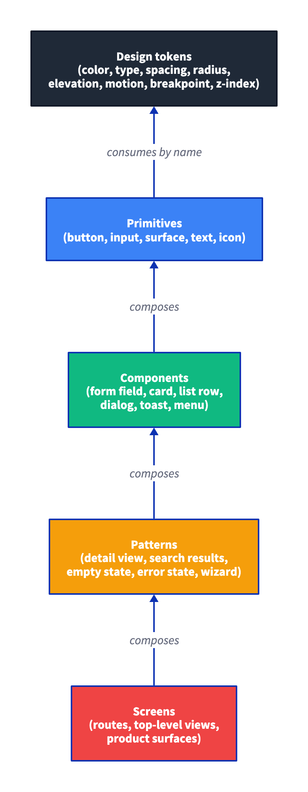
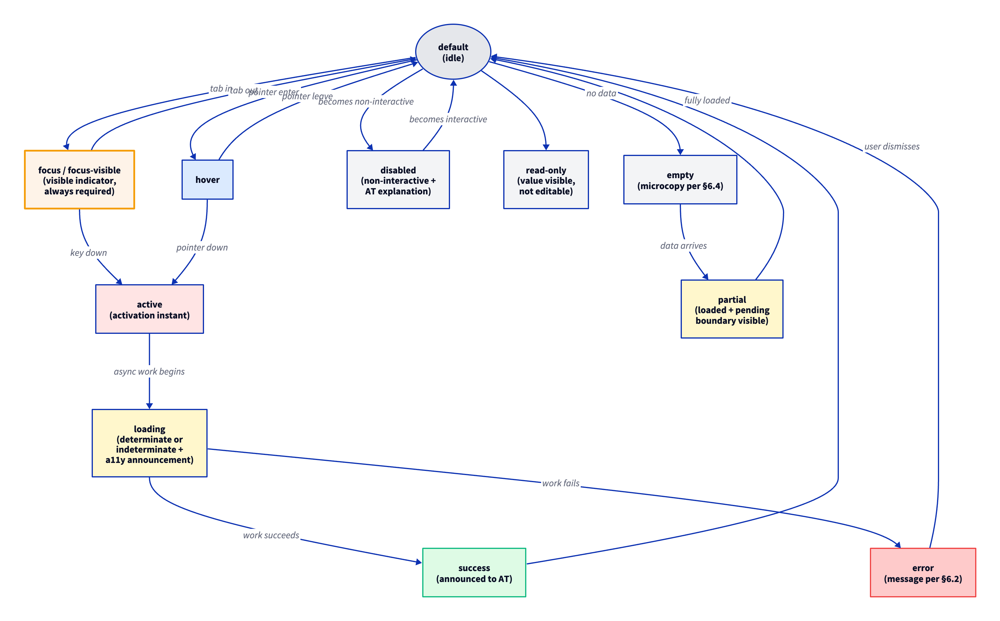
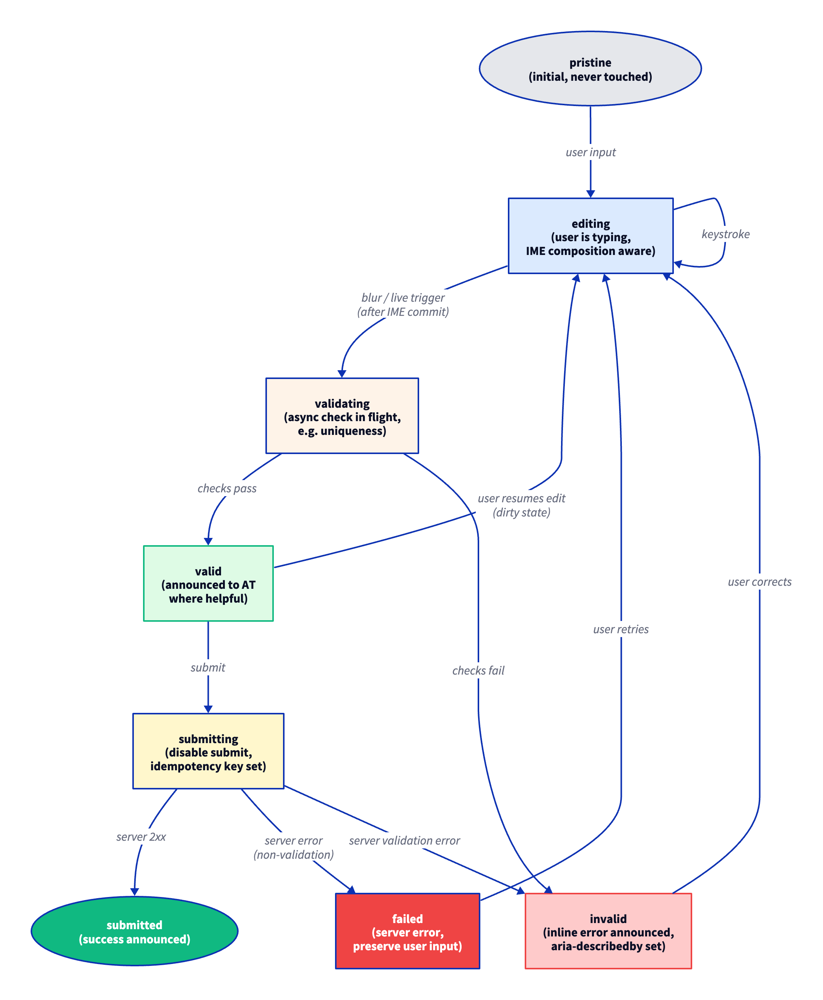
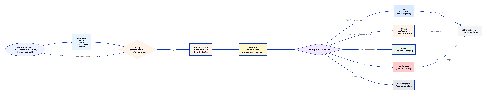
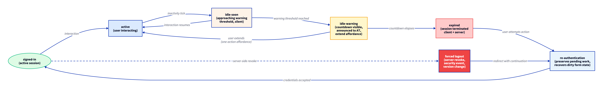
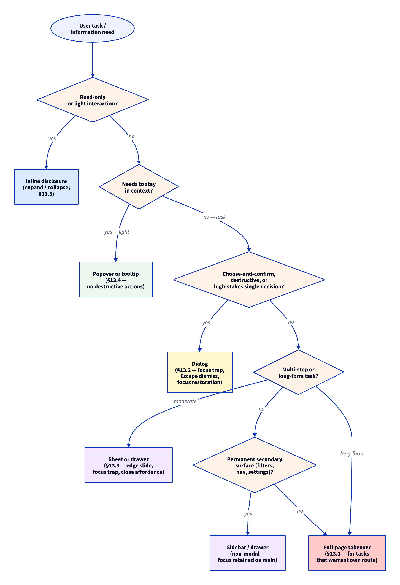
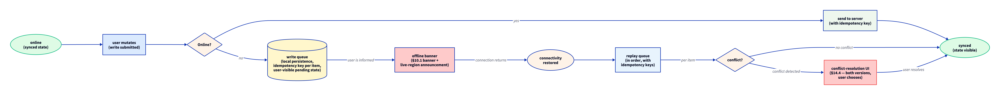
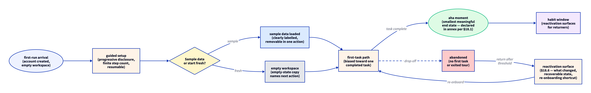
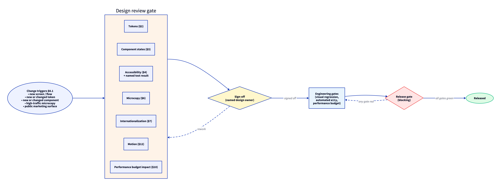
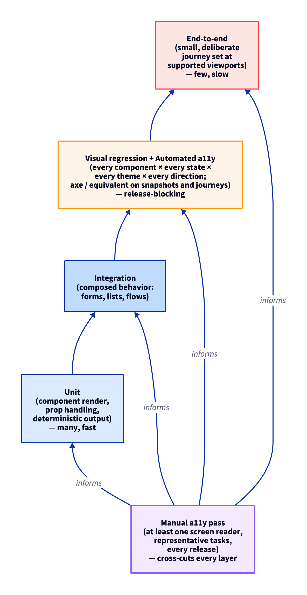

# Stribog UI/UX Standard

## 0. TL;DR

Every Stribog project that ships a user interface — web, mobile, desktop, dashboard, terminal UI, embedded display — ships it against this standard. A design token system is the source of truth for visual primitives. Components honor a declared state contract. The accessibility floor is WCAG 2.2 AA. Internationalization is the default. Microcopy is governed. Information architecture, forms, notifications, authentication, data presentation, modality, drag-and-drop, real-time updates, AI-generated surfaces, perceived performance, offline behavior, onboarding, embeds, adjacent surfaces (email / PDF / print), the UI security boundary, and native-platform conventions are each governed surfaces of this standard. The frontend has performance budgets and a release-blocking gate. Telemetry is consent-first. A UI release that has not passed the design review gate, the accessibility test set, and the performance budget gate is not a complete release.

## 0.1 Why This Standard Exists

The existing charter set governs documentation, engineering practice, security, privacy, operational delivery, and AI-agent execution. It does not govern the user interface surface itself — the visual system, the component contract, accessibility, microcopy, internationalization, frontend performance, telemetry consent, and the interaction surfaces a user actually touches (forms, navigation, notifications, sessions, tables, modals, drag, real-time, AI, offline). A project can be fully compliant with every existing standard and still ship a UI that is unusable, inaccessible, untranslatable, untrustworthy, or hostile to the way the user actually works.

This standard fills that gap. It is the binding rule set for every UI surface a Stribog project ships, and for every interaction primitive that surface composes.

## 0.2 Applicability

This standard binds every Stribog project that ships any of:

- a web application or web component
- a mobile application (iOS, Android, or any equivalent runtime)
- a desktop application (any platform)
- a terminal user interface, including TUIs and rich CLI surfaces with screen-painting behavior
- a dashboard, status board, or visualization surface
- an embedded display, kiosk, or on-device UI
- a UI delivered by an AI-generated rendering layer (artifact UIs, generated dashboards, agent-rendered surfaces)
- transactional email, PDF, or print surfaces that carry the project's voice or accept user input

A CLI whose surface is line-oriented output and flag parsing is governed by the [[Stribog User Documentation Standard]] §7 (in-product help) and the [[Universal Stribog Engineering Charter]] §3.3 (thin interface layers), and is not bound by §3, §4 (visual and pointer-focused clauses), §5 (responsive layout clauses), or §25 (browser performance clauses) of this standard except where the corresponding terminal-surface analogue is named.

A project whose UI is entirely internal to its implementation team declares the scope in the [[Charter Compliance Annex]] and is exempt from §26 (telemetry) and §23 (design review gate) while remaining bound to §3, §4, §6, and §28.

## 0.3 Definitions

This standard relies on the [[Stribog Glossary]] for cross-cutting terms. UI/UX-specific terms used in this document:

- **Design token:** a named, machine-readable value that represents a single visual primitive — a color, a typographic step, a spacing unit, a radius, an elevation, a duration. Tokens are the source of truth; component code consumes tokens by name and does not hard-code values.
- **Token layer (primitive / semantic / component):** the layered organization of the token registry. *Primitive* tokens hold raw values (`color.blue.500 = #2563EB`); *semantic* tokens hold intent (`color.surface.accent → color.blue.500`); *component* tokens hold per-component bindings (`color.button.primary.background → color.surface.accent`). Component code consumes the highest applicable layer.
- **Component state contract:** the declared set of visual and behavioral states every interactive component supports.
- **WCAG 2.2 AA:** the World Wide Web Consortium's Web Content Accessibility Guidelines, version 2.2, conformance level AA. The minimum accessibility floor.
- **Microcopy:** the visible text on user-interface controls, labels, hints, errors, empty states, confirmations, and onboarding strings. Distinct from documentation prose.
- **Voice charter:** a written declaration of the project's UI voice — its register, its tone, its forbidden constructions, its preferred constructions.
- **Design review gate:** a release-blocking review at which a design change of declared significance is signed off by the design owner.
- **Performance budget:** a numeric ceiling on a measurable frontend signal (load latency, layout shift, interaction latency, bundle size, asset weight) that a release must not exceed.
- **Consent-first telemetry:** the discipline that no UI telemetry leaves the user's runtime until the user has affirmatively consented under the disclosures of the [[Stribog Data and Privacy Standard]].
- **Reduced-motion preference:** the user setting (`prefers-reduced-motion` or platform equivalent) that the UI must honor by replacing non-essential animation with non-animated equivalents.
- **Information architecture (IA):** the organization of the product surface into a navigable structure of routes, groupings, and labels that maps to the user's mental model.
- **Live region:** a region of the UI that programmatically announces dynamic updates to assistive technology via the platform's live-region facility (`aria-live`, `UIAccessibilityAnnouncementNotification`, equivalent).
- **Optimistic UI:** the discipline of reflecting the assumed outcome of a user action immediately, then reconciling against the real outcome — including the rollback path on failure.
- **Skeleton:** a placeholder rendering that preserves layout while real content is loading, distinct from a spinner.
- **Stale-while-revalidate:** the discipline of rendering the last known value immediately and replacing it once a fresh value arrives, with a visible indicator while the revalidation is in flight.
- **Write queue:** an offline-aware buffer of pending user mutations, applied to the server once connectivity returns, with conflict-resolution and idempotency rules.
- **Presence indicator:** a UI signal that another user is currently viewing or editing a shared surface.
- **Streaming UI:** a UI surface whose content arrives incrementally — token-by-token model output, server-sent events, websocket chunks — and is rendered as it arrives.
- **Generative UI:** a UI surface whose structure, not only content, is generated at runtime by a model or a server-side template engine.
- **Forced-colors mode:** the OS-level high-contrast mode (`forced-colors: active`, Windows High Contrast, equivalent) under which the UA overrides author colors with a system palette. UI must remain usable under forced colors.
- **Modality:** the property of a surface that captures user attention to the exclusion of the surrounding context — a dialog, a sheet, a popover, a confirmation. Distinct from disclosure (expand / collapse).
- **Drop target:** a region the UI declares as eligible to receive a drag operation, with declared accepted types and a visible state contract.

## 1. Core Positions

The Stribog position on user interfaces is:

1. **Design tokens are the source of truth.** Hard-coded visual values in component code are non-compliant.
2. **Tokens are layered.** Primitive, semantic, and component layers are distinct. Component code consumes the highest applicable layer.
3. **The component state contract is exhaustive.** A component that does not handle every state in the contract is incomplete.
4. **Accessibility is a floor, not a ceiling.** WCAG 2.2 AA is the minimum; AAA is preferred where the content type permits.
5. **Internationalization is the default.** A project that has not declared a single supported locale still authors against the i18n discipline.
6. **Microcopy is governed.** UI strings are reviewed, owned, and follow the voice charter.
7. **Frontend performance has a numeric gate.** A release that exceeds its budgets is held.
8. **Telemetry is consent-first.** Implicit user tracking is non-compliant.
9. **Motion is honest.** Animation honors the reduced-motion preference and does not mislead the user about system state.
10. **Information architecture is a designed surface.** URLs, navigation, deep-linking, and the back button are part of the contract.
11. **Forms are an interaction surface, not a styling exercise.** Validation, autofill, multi-step, autosave, IME, and accessibility are all governed.
12. **Notifications are scoped, deduped, and accessible.** A toast is not a substitute for a confirmation.
13. **Sessions degrade gracefully.** Idle timeouts, sudden logouts, and re-authentication paths are designed surfaces.
14. **Data presentation is accessible.** Tables, charts, search, filter, pagination, file upload, and download honor keyboard and assistive-technology contracts.
15. **Modality is chosen, not defaulted.** Dialogs, sheets, and popovers each have a chosen contract; the wrong modality is a defect.
16. **Drag-and-drop has a keyboard alternative.** Always.
17. **Real-time UI is honest.** Presence, conflicts, and stale data are visible.
18. **AI-rendered surfaces obey this standard.** Streaming, citations, refusal, attribution, and disclosure are governed.
19. **Perceived performance is a discipline.** Skeletons, optimistic UI, and stale-while-revalidate are intentional, not improvised.
20. **Offline is a first-class state.** Detection, queueing, replay, conflict resolution, and idempotency are designed in.
21. **Onboarding is a finite, measurable journey.** Progressive disclosure, sample data, and reactivation are governed.
22. **Embedded surfaces obey the standard.** Stribog UI inside a third-party host, or third-party UI inside Stribog, both bind.
23. **Adjacent surfaces obey the standard.** Email, PDF, and print carry the same voice and accessibility floor.
24. **The UI is a security boundary.** Content Security Policy, sandboxed iframes, autofill safety, clickjacking protection, and credential UX are governed surfaces.
25. **Native platform conventions are honored where the project ships to native.** Cross-platform consistency yields to platform expectation where the platform expectation is the user's mental model.
26. **The Charter Compliance Annex governs project-specific declarations.** Token registry location, component library, target browsers and devices, locales, voice charter, performance budget targets, telemetry pipeline, design owner, IA contract, form pipeline, notification surface, session policy, data-presentation toolchain, AI rendering pipeline, offline strategy, embed surface, and adjacent-surface tooling are declared per-project.
27. **UI surfaces produced by AI rendering layers obey this standard.** The fact that a surface is generated does not exempt it from accessibility, microcopy, telemetry, or any other clause.

## 2. Design System Foundations

### 2.1 Design Tokens

Every visual primitive in the UI is represented as a design token. The token set, at minimum, covers:

| Token family | Coverage |
|--------------|----------|
| `color` | Foreground, background, surface, accent, semantic (success, warning, error, info), interactive states. Light and dark theme variants are first-class. Forced-colors mode (§4.10) defines color-keyword mappings. |
| `typography` | Type family, weight, size step, line-height step. Type scale is a closed set. |
| `spacing` | A closed scale of spacing units. Arbitrary pixel offsets are non-compliant. |
| `radius` | A closed scale of corner radii. |
| `elevation` | A closed scale of shadow or layering values. |
| `motion` | A closed set of duration and easing values. |
| `breakpoint` | A closed set of viewport breakpoints. |
| `z-index` | A closed scale of stacking layers, named by intent. Arbitrary numeric z-index values are non-compliant. |
| `border` | A closed set of border styles and weights. |
| `opacity` | A closed scale of opacity values. |
| `density` | A closed scale of spacing multipliers for compact / comfortable / spacious layouts. |
| `iconography` | A closed scale of icon sizes and stroke widths bound to the icon system (§2.6). |

The token registry has a single canonical source declared in the [[Charter Compliance Annex]]. Component code consumes tokens by name. A hard-coded visual value in component code is non-compliant.

### 2.2 Token Layers

Tokens are organized in three layers:

| Layer | Purpose | Example |
|-------|---------|---------|
| **Primitive** | Raw values keyed by family and step. Carry no semantics. | `color.blue.500 = #2563EB` |
| **Semantic** | Intent-named tokens that alias primitives. Theme-switchable. | `color.surface.accent → color.blue.500` (light) / `→ color.blue.400` (dark) |
| **Component** | Per-component bindings that alias semantic tokens. Optional. | `color.button.primary.background → color.surface.accent` |

Component code consumes the highest layer that applies — a button consumes its component token; a screen consumes a semantic token; only the design system itself reaches into primitives. The token registry source follows the W3C Design Tokens Community Group (DTCG) format or an equivalent declared in the annex. A flat, one-layer token registry is non-compliant for projects with more than one theme.

### 2.3 Token Drift Detection

A drift gate runs on every CI run and fails when component code references a visual value that is not in the token registry. A second drift gate fails when component code reaches across token layers (a screen referencing a primitive directly). Both gates are binding under the [[Universal Stribog Engineering Charter]] §5.9.

### 2.4 Component Library

Every UI built under this standard sits on a declared component library. The library is the project's own, an adopted external one, or a combination, declared in the annex. The library:

- exposes a stable, versioned surface under the [[Stribog Developer Documentation Standard]] §6 stability contract
- ships a state-by-state visual reference for every component
- ships an accessibility annotation for every component (semantic role, expected keyboard behavior, ARIA usage)
- ships a microcopy slot specification for every component (which strings are author-supplied, which default from the library)
- is consumed by every product surface in the project; surfaces that bypass the library are explicitly listed and explained in the annex

### 2.5 UI Surface Layer Model

The UI surface is layered. Each layer depends only on the layer below.

The layer model is illustrated in `diagrams/07-ui-surface-layers.png`.

*Design tokens at the base. Primitives consume tokens. Components compose primitives. Patterns compose components. Screens compose patterns. Each layer depends only on the layer below.*

A component that reaches across layers — for example, a screen that hard-codes a token value rather than consuming a primitive — is non-compliant.

### 2.6 Icon and Asset System

Icons are first-class visual primitives. The icon system contract:

- icons are SVG, authored on a fixed grid declared in the annex (commonly 16 / 20 / 24 / 32 pixel boxes)
- stroke width, corner radius, and visual weight are consistent within a size; optical correction is applied per size where the geometry requires it
- icons are delivered as a typed component set or an SVG sprite, never as an icon font (icon fonts fail accessibility on font-substitution failures and lose currentColor semantics on some assistive technologies)
- every icon carries an accessible name or is explicitly marked decorative; icon-only interactive controls expose `aria-label` or equivalent
- the icon set is versioned and reviewed at the design review gate when icons are added or changed

Bitmap and vector assets that are not icons follow the §25.5 image-and-asset discipline. Brand and logo assets are governed by a separate brand layer declared in the annex; the design system inherits brand assets but does not own them.

### 2.7 Layout Primitives

The component library exposes a set of layout primitives — stack, inline, grid, cluster, center, splitter — that compose into the patterns and screens of §2.5. Layout primitives consume the spacing and breakpoint token families. Hand-rolled layout (raw flex / grid / margin in product code) is non-compliant where the equivalent layout primitive exists in the library.

### 2.8 Diagram Discipline for UI/UX Documentation

UI/UX documentation — the design-system spec, the component library reference, the design-review record, the accessibility annotation surface, the motion-token catalogue — depends on diagrams more than any other doc family. Diagrams in the UI/UX-doc surface are governed by the rules below in addition to the project-wide [[Stribog Documentation Standard]] §7, the [[Stribog User Documentation Standard]] §6.5, and the [[Stribog Developer Documentation Standard]] §3.12.

#### 2.8.1 D2 Is the Default for UI/UX Diagrams

Every structural diagram in UI/UX documentation — layer models, state machines, navigation flows, review-gate flows, test pyramids, dependency arcs between tokens, primitives, and components — is authored in D2 using the installed `d2` skill or `d2` CLI. Visual design artifacts that are not structural — the rendered visual specimen of a component, the side-by-side color swatch sheet, the type-specimen poster — remain in the project's design tool of record and are exported as images; those exports are not diagrams under this clause.

#### 2.8.2 The Component State Machine Is a Diagram

The §3 component state contract is documented in the component library as a D2 state machine per component class, not as prose alone. A component whose state contract exists only in prose is non-compliant.

#### 2.8.3 The Design Review Gate Is a Diagram

The §23 design review gate flow is documented as a D2 diagram in the project's design-review documentation. A design-review process whose entry, exit, and sign-off path are not visible as a diagram is non-compliant.

#### 2.8.4 Generated UI Diagrams

Where the diagram can be generated from the component library source — a dependency graph between components, a token-consumption map — generation is preferred. The generator is named in the [[Charter Compliance Annex]].

#### 2.8.5 Accessibility of UI/UX Diagrams

UI/UX diagrams that depict accessibility paths — focus order, keyboard navigation flow, screen-reader announcement sequence — carry an accessible prose summary in addition to alt text. A diagram depicting accessibility that is itself inaccessible is non-compliant.

### 2.9 Color Palette Construction

The token color family is constructed, not improvised. The contract:

#### 2.9.1 Perceptual Color Space

Color steps within a palette are constructed in a perceptual color space — OKLCH, OKLab, or LCH — not in sRGB hex. Steps within a hue are evenly spaced in perceptual lightness; the eye perceives the steps as evenly graded. Palettes that step by hex math produce visually irregular ramps and are non-compliant.

#### 2.9.2 Palette Topology

Every palette declares its topology in the annex:

- a small set of *brand* hues (typically 1–3 anchor hues)
- a *neutral* axis (greys; foreground / background steps in light and dark)
- a *semantic* set (success / warning / error / info) mapped to fixed hues
- *accent* hues for chart series and emphasis, mapped to avoid collision with the semantic set
- a *surface* axis for layered backgrounds (canvas / panel / popover / overlay)

A palette that mixes semantic and brand hues without naming the mapping is non-compliant.

#### 2.9.3 Step Density

Each palette dimension exposes enough steps that surfaces never need to interpolate at use time. The minimum step count for a hue is declared in the annex; common values are nine steps (`100`, `200`, … `900`) or eleven (`50`, `100`, … `950`).

#### 2.9.4 Accessibility-Aware Construction

Every interactive pairing the palette is intended to support — text on background, focus indicator on background, primary on accent — is verified against WCAG 2.2 AA contrast at construction time, not at audit time. The verification is automated as part of the §2.3 token drift gate.

#### 2.9.5 Color-Vision-Deficiency Verification

The palette is verified against the common color-vision deficiencies (protanopia, deuteranopia, tritanopia, achromatopsia). Where two palette steps collapse under simulation, the §4.5 redundant-channel rule applies and the collision is documented in the annex.

#### 2.9.6 Color Harmony

Color hues that appear adjacent in the UI follow a declared harmony rule — complementary, analogous, triadic, or a brand-declared bespoke harmony. Arbitrary hue mixing produces visual noise and is non-compliant.

#### 2.9.7 Gradient and Surface Treatment

Gradients are constructed in perceptual space; sRGB-space gradients produce muddy mid-tones and are non-compliant for surfaces that need polish. Surface tints (slight hue shifts in layered backgrounds) follow the §2.9.2 surface axis.

### 2.10 Spacing System and Rhythm

#### 2.10.1 Closed Scale

Spacing is a closed scale declared by the annex. Common scales follow a geometric progression (4 / 8 / 12 / 16 / 24 / 32 / …) or a modular ratio. Arbitrary spacing values in product code are non-compliant per §2.1.

#### 2.10.2 Baseline Rhythm

Type and spacing align to a declared baseline grid. Vertical rhythm — line-height and inter-block spacing — is a multiple of the baseline. Surfaces that drift off-baseline are visible to the trained eye and are non-compliant.

#### 2.10.3 Optical Adjustment

Where strict grid alignment looks visually wrong — icons next to text, glyphs with strong directional weight, mixed-weight elements — the design system permits optical adjustment. The adjustment is documented in the component library (as a token alias or a component-token override), not improvised in product code.

#### 2.10.4 Density Multipliers

Per §5.5, density preferences scale the base spacing scale by declared multipliers. Compact, comfortable, and spacious are all valid users of the same token family; product code does not branch on density.

#### 2.10.5 Whitespace as a First-Class Element

Whitespace is a design element. Sections, cards, and groups carry declared margin and gutter values that distinguish hierarchy. Dense surfaces (§12) declare their density and still honor the spacing scale.

### 2.11 Theme System

#### 2.11.1 Theme Beyond Light and Dark

§5.3 establishes the light / dark requirement. §2.11 governs the theme system as a whole — multi-brand themes, multi-tenant themes, accent customization, accessibility themes, and the architecture that makes them work without forking the component library.

#### 2.11.2 Theme Composition

A theme is a coherent set of token overrides at the semantic and component layers (§2.2). The primitive layer is rarely themed; the semantic layer is theme-switchable; the component layer may have theme-specific bindings. The theme system enumerates every theme the project ships in the annex.

#### 2.11.3 System-Following Discipline

The default theme follows the OS-level preference (light / dark / accent color / contrast preference / reduced motion). The product offers a per-user override that persists across sessions and devices where the platform permits.

#### 2.11.4 Theme Parity

Every product surface renders correctly in every shipped theme. Visual regression (§24.2) captures every component in every theme. A surface that "looks fine in light but breaks in dark" is non-compliant.

#### 2.11.5 Accent and Tenant Customization

Where the project allows user or tenant accent customization, the customization is bounded — accent overrides flow through declared semantic tokens, not arbitrary hex values, and the contrast verification of §2.9.4 is enforced at customization time. A user-chosen accent that fails contrast is rejected with helpful feedback.

#### 2.11.6 Theme Switcher UX

The theme switcher is reachable from a consistent surface (typically the user-preferences area), is keyboard-operable, announces the change to assistive technology, and previews the change before commit where the change is non-trivial.

#### 2.11.7 Accessibility Themes

Accessibility-specific themes (high-contrast, larger-text, reduced-transparency) are first-class themes, not hidden modes. They follow the same authoring and testing discipline as light / dark.

### 2.12 Visual Polish and Finishing Standard

#### 2.12.1 Polish Is Governed

*Polish* — the layer of craft that distinguishes a working UI from a finished UI — is governed under this standard. Polish is not a final phase that may be skipped; it is a continuous discipline that every shipped surface meets.

#### 2.12.2 Alignment and Pixel Precision

UI elements align to the spacing grid of §2.10. On non-fractional displays, integer pixel boundaries are preserved where the rendering pipeline supports it. Half-pixel rendering, anti-aliased fringes, and sub-pixel drift are visible defects.

#### 2.12.3 Type Rendering

Type rendering follows the platform's recommended pipeline:

- font-feature flags (kerning, ligatures, contextual alternates) are enabled where the font supports them
- font weights map to the variable-font axis or the static-weight set declared in the annex; faux-bold and faux-italic are non-compliant
- numeric figures render as tabular figures in tables, columns, and other surfaces where digits align; proportional figures in body prose
- font smoothing is consistent across surfaces; per-surface font-smoothing overrides are non-compliant unless justified in the annex

#### 2.12.4 Shadow, Elevation, and Depth

Elevation tokens (§2.1) define a small set of allowable shadow values. Shadows are soft, multi-layer, color-aware (a shadow under a colored surface tints toward that surface's hue, not pure black), and theme-aware (dark themes use distinct elevation treatments — typically lighter overlays rather than darker shadows).

#### 2.12.5 Edge, Stroke, and Border Polish

Borders are consistent in weight, color, and treatment across components. Border-image artifacts (one-pixel gaps, anti-alias seams, asymmetric corner radii on adjacent siblings) are visible defects.

#### 2.12.6 Surface Treatment and Material

Where the design system uses surface treatments — glass, frost, gradient overlay, paper texture, noise grain — the treatment is declared as a token and applied consistently. Ad-hoc surface treatment in product code is non-compliant.

#### 2.12.7 Iconography Polish

Per §2.6 the icon system is grid-based and stroke-consistent. Polish adds:

- optical correction at small sizes (a circle at 12px draws slightly larger than at 24px to compensate for visual weight loss)
- alignment with text baselines (icons placed inline with text sit on a declared optical baseline, not the text baseline)
- color-aware icon treatment (an icon next to colored text inherits or contrasts deliberately, not by accident)

#### 2.12.8 Illustration and Brand Asset Polish

Where the project ships illustrations, the illustration set is consistent in style (line weight, color palette, perspective, character treatment). Mismatched illustration styles across surfaces are visible defects.

#### 2.12.9 Empty and Edge-State Polish

The empty state, the error state, the loading state, the offline state — all receive polish equal to the happy-path. A bare, unstyled error page is a polish failure.

#### 2.12.10 Polish Pass at Sign-Off

The design review gate of §23 includes a polish pass — alignment, type rendering, shadow consistency, edge treatment, icon-text optical alignment, illustration consistency, edge-state styling. A change that ships without a polish pass cannot pass the design review gate.

## 3. Component State Contract

Every interactive component supports the state set below, where the state is meaningful for that component class.

### 3.1 Required States

| State | Meaning |
|-------|---------|
| `default` | Idle, ready to accept interaction. |
| `hover` | Pointer over the component. Non-applicable on touch-first surfaces. |
| `focus` | Keyboard focus. Always applicable; never optional. |
| `focus-visible` | The visible-focus variant on platforms that distinguish keyboard focus from programmatic focus. |
| `active` | The instant of activation — pointer down, key down. |
| `disabled` | Non-interactive by design. Carries an explanation accessible to assistive technology. |
| `read-only` | Display-only. Distinct from disabled; the user can copy the value. |
| `loading` | Work in progress. Carries an indeterminate or determinate signal and is announced to assistive technology. |
| `empty` | No data to display. Carries microcopy per §6.4. |
| `partial` | Data partially loaded or partially valid. The boundary between loaded and pending is visible. |
| `stale` | Last known value is rendered while a revalidation is in flight (§16.3). |
| `error` | Operation failed. Carries an error message per §6.2. |
| `success` | Operation succeeded. Announced to assistive technology where the outcome is non-visible. |
| `selected` / `checked` | Selection state, where applicable. |
| `expanded` / `collapsed` | Disclosure state, where applicable. |
| `dirty` / `clean` | For form components — whether the value differs from the last-saved value (§9.7). |
| `invalid` / `valid` | For form components — whether the value satisfies the declared validation (§9.2). |
| `drag-active` | Component is the source of an active drag operation (§13.6). |
| `drop-target` / `drop-eligible` / `drop-forbidden` | Component is a declared drop region, with accept / reject state (§13.7). |

A component that omits a state from the contract is non-compliant unless the [[Charter Compliance Annex]] declares the omission with a reason.

### 3.2 State Visibility

Every state is visually and programmatically distinguishable. Reliance on color alone is forbidden per §4.5. Reliance on motion alone is forbidden per §27.2. Reliance on a single sensory channel (color, motion, sound, position) is forbidden across the state set.

### 3.3 Component State Diagram

The state contract is illustrated as a state machine in `diagrams/08-component-states.png`.

*The required state machine for an interactive component. Every transition has a defined trigger and a defined accessible announcement.*

### 3.4 State Snapshots in the Component Library

The component library renders a visible snapshot of every required state for every component. The snapshot set is exported and reviewed; a state that is implemented but never rendered for review is non-compliant.

## 4. Accessibility Standard

### 4.1 Floor: WCAG 2.2 AA

Every UI surface conforms to WCAG 2.2, conformance level AA, at minimum, across the perceivable, operable, understandable, and robust principles. Surfaces that handle public-sector users, regulated industries, or accessibility-critical workflows declare a higher floor in the [[Charter Compliance Annex]] where the customer or jurisdiction requires it.

### 4.2 Keyboard Operability

Every interactive surface is operable from a keyboard alone, without a pointer. The keyboard contract:

- every interactive control is reachable by `Tab` order in a sensible sequence
- every action available to a pointer user is available to a keyboard user
- focus is never trapped except in modal contexts where the trap is intentional, scoped, and reversible with a documented escape
- a visible focus indicator is always rendered on the focused element
- shortcut keys, where used, do not collide with assistive-technology bindings, are platform-aware in their modifier choice (`Cmd` on macOS, `Ctrl` on Windows / Linux), and are listed both in a discoverable in-product help surface (§6.7) and in the user-facing reference

### 4.3 Focus Management

Focus is managed explicitly across navigation, dialog open and close, asynchronous content load, and dynamic insertion. The contract:

- opening a dialog moves focus into the dialog and restores focus to the originating control on close
- inserting content does not move focus unless the user's task requires it
- a route change moves focus to a predictable target (typically the top of the new view or the first heading) and announces the change to assistive technology (§8.6)
- focus is never lost into the document body unintentionally

### 4.4 Semantic Structure and ARIA

UI surfaces use native semantic elements first. ARIA is used to bridge a gap that native semantics cannot fill, not to substitute for them. The contract:

- pages are structured by semantic headings
- landmark regions are named and not duplicated arbitrarily
- live regions are scoped to the announcements they must carry, and are not polluted with chatter (§10.5)
- `aria-label`, `aria-labelledby`, and `aria-describedby` are correct, current, and minimal

ARIA misuse is forbidden — incorrect roles, conflicting roles, redundant roles, or roles applied to elements that cannot receive them.

### 4.5 Color and Non-Color Channels

Information is not conveyed by color alone. Every color-coded signal — status, validity, severity — carries a redundant channel: text, icon, shape, position, or pattern. Token color contrasts meet the WCAG 2.2 AA contrast minimums for the role they serve, including text on background, focus indicator on background, and non-text interactive elements. The token color palette is verified color-blind-safe for the common color-vision deficiencies, or compensates with the redundant-channel rule.

### 4.6 Motion and the Reduced-Motion Preference

Animation honors the user's reduced-motion preference. Where the preference is set, non-essential animation is replaced with an instant or near-instant transition. Essential motion — motion that carries information the static state does not — is preserved but is held below the motion-disorder thresholds named in WCAG.

### 4.7 Text, Reading, and Zoom

Text size scales with user preferences. Layouts reflow at the WCAG-required minimum scaling without loss of content or function. Line length, line height, paragraph spacing, and letter spacing meet the reflow and spacing criteria of WCAG 2.2 AA. The UI is verified at **200% zoom** without horizontal scrolling at the project's smallest declared viewport, and at **400% zoom** with reflow per WCAG 2.2 1.4.10. Both checks are part of the automated and manual accessibility passes (§24.3).

### 4.8 Touch Targets

Pointer and touch targets meet a minimum size declared in the annex, at or above the WCAG 2.2 target-size criterion for the surface class. Touch targets that fall below the floor declare a documented exception in the annex with a stated rationale.

### 4.9 Assistive Technology Coverage

Every UI surface is tested with at least one screen reader on at least one platform declared in the annex, every release, on a defined sample of representative tasks. The sample, the screen reader, and the platform are declared in the annex. Stribog projects ship to at least one of: VoiceOver on macOS or iOS; NVDA or JAWS on Windows; TalkBack on Android; Narrator on Windows.

### 4.10 Forced-Colors and High-Contrast Mode

The UI is usable under forced-colors mode (`forced-colors: active`, Windows High Contrast, equivalent). The contract:

- author colors are remapped to system colors via the `system-color()` palette or the platform equivalent
- borders and outlines remain visible in forced-colors mode for elements that rely on background-color shifts for state distinction in default mode
- focus indicators meet contrast in forced-colors mode
- images that carry information in their visual rendering have an accessible alternative when forced-colors flattens or remaps them

A surface that becomes unusable under forced-colors mode is non-compliant.

### 4.11 Captions, Transcripts, and Time-Based Media

Audio carries a transcript. Video carries captions (open or closed) and, where appropriate, a transcript. Autoplay of audio is forbidden by default; where unavoidable, it is muted and the user has a clearly-visible control to unmute. Media controls are keyboard-operable and labelled.

### 4.12 Cognitive Accessibility

Interface complexity is bounded. Tasks that span multiple screens carry a visible progress indicator with a step count. Error recovery does not require the user to re-enter data already entered. Required actions are described in plain language; jargon is named on first appearance. Time limits, where they exist, are extendable, adjustable, or removable in line with WCAG 2.2 2.2.1, unless the limit is essential to the activity.

## 5. Responsive and Adaptive Design

### 5.1 Breakpoint Discipline

Breakpoints are a closed token set per §2.1. Component code consumes breakpoints by name. Arbitrary media-query thresholds outside the token set are non-compliant. Container-query thresholds, where used, are also a closed token set declared in the annex.

### 5.2 Viewports and Devices

The supported viewport range and the supported device class set are declared in the annex. The UI is tested at the declared range and class set every release. A surface that fails at a declared viewport is non-compliant.

### 5.3 Dark Mode

A dark theme is offered for every web and desktop surface. The dark theme is built from the dark variants of the token color family. The dark theme is tested under the same accessibility, performance, and component-state contracts as the light theme. Dark theme as a per-component opt-out is non-compliant; either the theme covers the surface or it is not offered. Theme preference honors the OS-level setting by default and exposes a per-user override; the override persists across sessions.

### 5.4 Right-to-Left and Bidirectional Text

UI surfaces support right-to-left text direction where the declared locale set includes at least one RTL locale. RTL support is structural — layout mirroring, icon direction (directional icons mirror; symbolic icons do not), scroll direction, focus order — not only translation of strings. Icons in the icon system declare their mirroring policy as metadata; the renderer honors the policy.

### 5.5 Density and Layout Preferences

Where the project offers a density or layout preference (compact, comfortable, spacious), the preference is built from the spacing token family and is honored by every screen. Inconsistent density across screens is non-compliant.

### 5.6 Container Queries and Intrinsic Sizing

Where the runtime supports container queries, components reason about their own size rather than the viewport's. Intrinsic-size primitives — `min-content`, `max-content`, `fit-content` — are preferred to fixed sizes for content that scales with locale or user preference.

## 6. Microcopy, Voice, and Tone

### 6.1 The Voice Charter

Every project under this standard declares a *voice charter* in or alongside the [[Charter Compliance Annex]]. The voice charter names:

- the register (formal, neutral, casual)
- the person (first, second, third) and the tense
- the preferred constructions
- the forbidden constructions, in addition to the forbidden filler in the [[Stribog Documentation Standard]] §5.4
- locale-specific tone notes where the locale set requires them

UI microcopy that violates the voice charter is non-compliant.

### 6.2 Error Message Standard

An error message tells the user what happened, why, and what to do. It does so in the user's terms, not in implementation terms. The contract:

- name the failure in plain language
- name the next action the user can take, where one exists
- never surface an internal exception class, an internal identifier, or an implementation stack trace as the primary message
- carry a secondary support reference (a log identifier, a correlation id) where one will help the user reach support
- be reachable to assistive technology — error states are announced, not only colored

### 6.3 Confirmation and Destructive Action Phrasing

A destructive or irreversible action carries a confirmation phrased in terms of the user's intent and the consequence, not in terms of the affordance. The confirmation explicitly names what will be lost. A confirmation phrased as a yes/no question on a generic verb is non-compliant for destructive actions. Where the action is reversible, an *undo* affordance is preferred to a confirmation; an unreversible action carries the confirmation.

### 6.4 Empty States

Every list, table, dashboard, or repeater renders an empty state. The empty-state copy names what the reader is looking at, why it is empty, and the next action that will populate it. A bare "No items" is non-compliant. Distinguish *empty by design* (the user has not yet created anything) from *empty by query* (the user's filter or search returned nothing) — each carries distinct copy.

### 6.5 Onboarding Microcopy

Onboarding strings — first-run hints, contextual help drawer copy, tour steps — follow the voice charter and the [[Stribog User Documentation Standard]] §7 in-product help discipline. Onboarding strings are reviewable in bulk; a string that escapes the catalogue is non-compliant.

### 6.6 Forbidden in Microcopy

In addition to the [[Stribog Documentation Standard]] §5.4 list:

- *uh oh*, *whoops*, *oops*
- *something went wrong* as the entire error message
- emoji as the sole carrier of meaning
- exclamation marks in error messages
- the word *user* addressing the reader; the reader is *you*
- *please* as a softener in instructions (the imperative is sufficient)
- ALL-CAPS in body text or labels (acceptable only in defined typographic styles such as eyebrow labels or button overlines, and only where contrast is preserved in localization)

### 6.7 Keyboard Shortcut Microcopy and Discovery

Where the UI exposes keyboard shortcuts, a discoverable cheatsheet — typically opened with `?` or an equivalent platform-aware binding — lists every shortcut grouped by surface. Shortcuts are rendered with platform-aware glyphs (`⌘` on macOS, `Ctrl+` on Windows / Linux). Custom shortcut binding, where supported, is exposed in a preference surface, persisted per user, and reset to defaults from a single named action.

## 7. Internationalization and Localization

### 7.1 i18n by Default

Every UI surface is authored against the i18n discipline regardless of the current locale set. Strings are externalized; pluralization, gender, date, time, number, and currency are formatted through locale-aware APIs; concatenation of localized fragments is forbidden.

### 7.2 Locale Set

The locales the project ships and the locales the project actively maintains are declared in the [[Charter Compliance Annex]]. A *shipped* locale is visible to users; a *maintained* locale is updated on the project's translation cadence.

### 7.3 Pluralization, Gender, and Variables

Plural forms are produced through the CLDR plural categories. Gendered forms are produced through the locale's gender rules. Numeric variables in strings are formatted through locale-aware formatters; raw numeric interpolation is non-compliant.

### 7.4 Date, Time, and Currency

Date, time, and currency presentation is locale-aware. Hard-coded date formats, currency symbols, or number separators in UI code are non-compliant. Time zone display is explicit where the value is unambiguously time-zoned; relative date phrasing ("3 days ago") is acceptable for transient surfaces but accompanied by an exact tooltip or aria-description.

### 7.5 Translation Lifecycle

The translation pipeline — translator, reviewer, fallback policy, glossary management, machine-translation usage rules — is declared in the annex per the [[Stribog User Documentation Standard]] §8.3.

### 7.6 RTL and Bidi

The §5.4 RTL clause applies. Bidirectional text within strings — for example, an LTR identifier inside an RTL sentence — uses the locale's directional markers correctly. Visual mirroring of glyph-directional icons follows the locale.

### 7.7 Pseudo-Localization in Test

A pseudo-localization test build is produced and exercised at least once per release where the project ships more than one locale. The pseudo-localization build exposes string concatenation, layout breakage, and untranslated strings.

### 7.8 Sector-Specific Locale Handling

For projects bound by sector regulations that prescribe locale conventions (financial reporting calendars, healthcare date formats, government identifier formats), the locale-handling extension is declared in the annex. The default locale-aware APIs are extended, not bypassed.

## 8. Information Architecture and Navigation

### 8.1 Information Architecture Is a Designed Surface

The product's information architecture — the routes, groupings, labels, and hierarchy a user navigates — is designed deliberately, documented, and owned. The IA contract is declared in the annex: top-level surfaces, second-level groupings, the rule for promoting a surface to a top level, the deprecation rule for retiring a surface. A product whose IA emerged from feature accretion without a designed organization is non-compliant.

### 8.2 URLs Are Part of the Contract

For web surfaces, URLs are a designed surface, not an implementation detail:

- URL structure mirrors the IA hierarchy
- URLs are stable across releases; URL changes carry redirects and are recorded in the [[Stribog Developer Documentation Standard]] §6 deprecation register
- URLs are humanly readable and shareable; opaque GUID paths are non-compliant for surfaces a user might bookmark or share
- URL parameters are documented and externally observable; transient state lives in URL parameters where the user might want to restore it

For non-web surfaces, the analogous addressable identifier (deep-link URI, route name, navigation token) follows the same discipline.

### 8.3 Navigation Patterns

Every product surface fits a named navigation pattern declared in the annex. Common patterns: top navigation, side navigation, tab bar, hub-and-spoke, breadcrumb-driven hierarchical. Mixing patterns within a single product is non-compliant unless the annex names the mix and the rule that distinguishes when each applies.

### 8.4 Deep-Linking and Back-Button Discipline

Every shareable surface is deep-linkable. A user who follows a deep link arrives at the surface with the same state (filters, selection, expanded sections) as a user who navigated there. The back button — system or in-app — restores the previous surface state, including scroll position, selection, and expanded disclosures. A surface that breaks the back button is non-compliant.

### 8.5 Scroll Restoration

A surface that the user has scrolled, then navigated away from, then returned to, restores its previous scroll position when the user expected to resume rather than reset. The distinction between *resume* and *reset* is declared in the IA contract — navigating back resumes; navigating forward to a fresh instance of the same surface class resets.

### 8.6 Route-Change Announcement

A route change is announced to assistive technology — typically by moving focus to the new view's primary heading and using a live region to announce the new surface's title. Silent route changes are non-compliant.

### 8.7 Breadcrumbs

Hierarchical surfaces deeper than two levels render a breadcrumb. Breadcrumbs are not decoration; each segment is a usable link to its level. Breadcrumb labels match the IA labels; a breadcrumb that diverges from the surface label is non-compliant.

### 8.8 Empty and Not-Found Surfaces

Every navigable address — including invalid ones — resolves to a designed surface. A 404 (resource not found), a 410 (resource permanently gone), and a 401 / 403 (unauthorized) each render distinct, helpful copy with navigation back to a known surface. A generic crash page that does not name the failure class is non-compliant.

### 8.9 Search as Navigation

Where the project ships a global search, search is a first-class navigation surface — keyboard-discoverable, accessible, and exposing structured results (recents, suggestions, scoped queries). Search is documented in the IA contract as a parallel-to-hierarchy navigation path.

### 8.10 Sitemap

A sitemap — machine-readable for web surfaces, equivalent for other platforms — declares every navigable surface in the project. The sitemap is generated from the route table where the framework permits; manual sitemaps are reviewed every release.

## 9. Forms and Input

### 9.1 Form as Designed Surface

A form is a designed surface, not a styling exercise around a `<form>` tag. Every form is owned, documented, and bound to a declared submission contract: field set, validation rules, server response shape, recovery behavior.

### 9.2 Validation Timing

Validation has three timing contracts. Each form declares which it uses, per field:

- **On submit** — validation runs only when the user submits. Used for low-stakes fields where premature validation would distract.
- **On blur** — validation runs when the user leaves the field. The default for most fields.
- **Live** — validation runs as the user types. Used sparingly, primarily for password-strength or format-checking with low cognitive cost.

Inline error messages render adjacent to the field, are programmatically associated with the field via `aria-describedby` or platform equivalent, and are announced to assistive technology on appearance. Success states are visible where the user benefits from confirmation; not every field needs an explicit success state.

The form-validation state machine is illustrated in `diagrams/11-form-validation-state.png`.

*The validation lifecycle: pristine → editing → validating → valid / invalid → submitting → submitted / failed. Every transition is announced to assistive technology where it changes the field's accessible state.*

### 9.3 Labels and Hints

Every form field has a visible label. Placeholder text is not a label. Hints sit adjacent to the field, not inside it, and are programmatically associated. Required fields are marked redundantly — by an asterisk, by a `required` attribute, and by the form's submission failure announcement.

### 9.4 Autofill and Autocomplete

Form fields declare their semantic content via the `autocomplete` attribute (or platform equivalent) so password managers and browser autofill operate correctly. A login form whose username and password fields do not carry `autocomplete="username"` and `autocomplete="current-password"` is non-compliant. New-password fields use `autocomplete="new-password"`. Address, payment, and contact fields use the WHATWG autofill token set.

### 9.5 Input Modes and Keyboard Types

Numeric, decimal, email, telephone, and URL fields declare the appropriate input mode so on-screen keyboards present the correct layout. Mismatched input modes (a text keyboard on a numeric-only field) are non-compliant.

### 9.6 IME, Composition, and Variable-Width Characters

Forms handle IME composition correctly — validation does not fire mid-composition, and submission waits for the composition to commit. Maximum-length constraints are stated in grapheme clusters, not code units; an `emoji` is one character to the user. East-Asian and right-to-left input modes are exercised in the locale test set.

### 9.7 Dirty / Clean State and Unsaved-Changes Protection

A form whose value differs from the last-saved value is in a `dirty` state. The dirty state is visible in the surface header or save button. Navigating away from a dirty form prompts the user; the prompt is accessible and dismissable from the keyboard. Where the platform supports it, the dirty state activates the browser's unsaved-changes warning.

### 9.8 Multi-Step Forms

A multi-step form renders a visible progress indicator (step *N* of *M*, with step labels) per §4.12. Steps can be revisited; previously-entered values are preserved. Validation runs per step at the transition; a step that fails validation does not let the user proceed.

### 9.9 Autosave

Long-form input (drafts, documents, configuration screens) is autosaved at intervals declared in the annex. Autosave state — *saving*, *saved at HH:MM*, *failed to save* — is visible and accessible. A draft that has not yet synced is preserved in local storage where the platform permits, and is offered for recovery on next visit.

### 9.10 File and Media Input

File input fields support drag-drop where the platform allows, with a keyboard-equivalent file picker. File-type, file-size, and file-count constraints are stated up front and enforced on the client with clear error microcopy; client validation is corroborated on the server. Upload progress is visible; cancel and resume are available on uploads larger than the threshold declared in the annex. Drag-and-drop file input honors the §13.6 drag contract.

### 9.11 Password and Credential Fields

Password fields use `type="password"` (or platform equivalent), expose a visibility toggle, accept paste, and never silently truncate. Password requirements are listed before submission, not only after failure. Password-strength meters, where used, follow the §9.2 live-validation rule and announce strength changes to assistive technology. Two-factor codes use `autocomplete="one-time-code"` and the platform's autofill where available.

### 9.12 Submission, Idempotency, and Double-Click Protection

Submit buttons disable themselves on click until the request resolves, or implement idempotency keys, or both. A form submitted twice does not create two records. The submission state is visible (`loading` per §3.1), and the result is announced to assistive technology.

### 9.13 Forms in Read-Only and Disabled Modes

A form rendered for an unauthorized user, a closed record, or a non-editable view uses `read-only` state per §3.1, not `disabled`. The distinction matters: `read-only` preserves keyboard focus and copy-to-clipboard; `disabled` does not.

## 10. Notifications and Messaging Surface

### 10.1 Notification Taxonomy

A notification fits exactly one of the following types. Each type has a declared placement, persistence, and dismissal contract:

| Type | Carries | Placement | Persistence | Dismissal |
|------|---------|-----------|-------------|-----------|
| Toast | Transient feedback for the user's last action | Corner overlay | Auto-dismiss after a calculated duration | Auto + manual |
| Banner | Surface-wide condition that affects current work | Top of the surface | Until condition resolves | Manual or condition-driven |
| Inline | Feedback adjacent to the control that produced it | Inline | Until next user action | Replaced or dismissed |
| System notification | Out-of-app alert via OS / browser notifications API | Platform native | Per platform | Per platform |
| Email / push (adjacent) | Out-of-product alert | §21 adjacent surfaces | Per channel | Per channel |
| Modal alert | Surface-blocking high-stakes message | Centered overlay | Until user acknowledges | Manual |

A toast used for a high-stakes message is non-compliant. A modal alert used for transient feedback is non-compliant.

### 10.2 Priority and Dedup

Notifications declare a priority (`info` / `success` / `warning` / `error` / `critical`). Concurrent notifications are deduped by content, batched by source, and surfaced in priority order. A surface that floods the user with redundant toasts is non-compliant.

The notification priority and deduplication flow is illustrated in `diagrams/12-notification-priority.png`.

*Incoming notification events are normalised, deduped against active notifications, prioritised, and routed to the appropriate surface — toast, banner, inline, modal, or system — with an accessible announcement.*

### 10.3 Auto-Dismiss Duration

Toast auto-dismiss durations are calculated from the message length using the reading-rate constants declared in the annex, with a floor and ceiling. Auto-dismiss is suspended when the user has focus on the notification or has hovered the pointer over it. WCAG 2.2.4 *Interruptions* is honored: a user can postpone or suppress non-essential notifications.

### 10.4 Accessibility of Notifications

Every notification is reachable by assistive technology. The contract:

- toasts are announced via an `aria-live="polite"` region scoped to the toast surface; modal alerts via `aria-live="assertive"` or `role="alertdialog"`
- banners are landmark-region-scoped where the platform supports it
- dismissal is keyboard-reachable from the focused surface — a notification that requires a pointer to dismiss is non-compliant

### 10.5 Live-Region Scoping

Live regions are scoped to the minimum announcement set they must carry. A single `aria-live` region that fires for every UI change pollutes the screen-reader output and is non-compliant. The annex names the live-region scopes the project uses; new live regions are reviewed at the design review gate.

### 10.6 Notification Queue and Persistence

Where the system generates more notifications than the surface can display at once, the queue is exposed — a notification center, a history drawer — and persists across the session per the project's declared retention. Notifications that have been delivered to the user are marked read; the read / unread distinction is accessible.

### 10.7 System-Notifications Permission

Out-of-app system notifications require permission. The permission prompt is preceded by an in-app rationale; the platform's native prompt is not the first time the user sees the request. Recovery from a denied permission is documented and reachable.

### 10.8 Notifications Are Not Documentation

A persistent banner explaining how the product works is not a notification; it is documentation living in the wrong surface. The cure is to move the content to in-product help (§6.5 and [[Stribog User Documentation Standard]] §7), not to extend banner persistence.

## 11. Authentication, Session, and Permissions UI

### 11.1 Login Flow

Every login surface follows the contract:

- field set declares `autocomplete="username"` and `autocomplete="current-password"` per §9.4
- the surface offers credential-manager autofill and exposes a visible password-visibility toggle
- failed login messages do not disclose which of username or password is wrong (a security-posture rule under [[Stribog Security Posture Standard]] §8)
- recovery paths (forgot password, contact support) are visible from the failure state
- rate-limit and lockout feedback name the recovery path

### 11.2 Multi-Factor and Passkey

Multi-factor enrollment and challenge surfaces follow the platform's autofill conventions (`autocomplete="one-time-code"`, passkey-aware UI). Recovery codes are presented once with explicit guidance to store them; surfaces that present recovery codes have a copy-to-clipboard and a download affordance with the [[Stribog Data and Privacy Standard]] §6 sensitive-data discipline.

### 11.3 Session Expiry and Idle Timeout

Sessions that expire by inactivity warn the user before the timeout, with a visible countdown and a one-action extend affordance. The warning is announced to assistive technology and is keyboard-dismissible. A session that times out silently — logging the user out without warning — is non-compliant. The timeout duration and warning lead time are declared in the annex.

The session timeline is illustrated in `diagrams/13-auth-session-timeline.png`.

*The session lifecycle: signed-in → active → idle-soon → idle-warning → expired. Each transition carries an accessible announcement and a recovery path.*

### 11.4 Sudden Logout Recovery

Where a session is terminated server-side (revoked credentials, security event, version change requiring re-authentication), the user is redirected to a re-authentication surface that preserves their pending work where the platform permits. Dirty form state (§9.7) is recovered after re-authentication. A surface that drops the user back to the login page with no continuation context is non-compliant.

### 11.5 Account Switching

Where the project supports multiple identities (multi-account, tenant switching, persona switching), the switching surface is one navigation level away, declares the current identity clearly, and announces identity changes to assistive technology. A surface that conflates two identities — making a user act under a different identity without a visible cue — is a critical defect.

### 11.6 OAuth and Third-Party Handoff

OAuth-style handoffs (Sign-in-with-X, delegated authorization) declare the third party, the scopes requested, and the return URL. Return-from-third-party state is communicated to the user — success, denial, error — and the failure path is helpful.

### 11.7 Permission Prompts

Native permission prompts (camera, microphone, location, notifications, contacts, files) are preceded by an in-app rationale that names the reason and the consequence. The rationale is shown once per fresh request, not repeated against an existing denial. Recovery from denial is documented and reachable from the surface that needs the permission.

### 11.8 Consent Surfaces

Consent for telemetry (§26) and for sector-regulation data uses (§26.7) are first-class UI surfaces. The consent surface declares purpose, retention, and revocation in plain language. A consent prompt that pre-selects acceptance, or whose decline path is buried, is non-compliant.

### 11.9 Cookie and Storage Notifications

For web projects in jurisdictions that require cookie or storage notifications (GDPR, ePrivacy, equivalent), the notice is rendered as a banner per §10.1, is accessible, and offers granular control. A wall-style consent gate that blocks all functionality until accepted is non-compliant unless the legal regime mandates it.

### 11.10 Sign-Out Discipline

Sign-out is one action, discoverable from a consistent location. Sign-out terminates the session client-side and propagates to the server. After sign-out the surface returns to a known anonymous state; cached identifiable content is cleared from view.

## 12. Data Presentation Surfaces

### 12.1 Tables and Data Grids

Tables that present structured data use the platform's native table semantics (`<table>` on the web, `UITableView` on iOS, equivalent elsewhere). Sortable columns expose sort state via the accessible API. Sticky headers preserve column context on scroll. Resizable columns retain their widths per user. Keyboard navigation follows the platform's grid pattern (arrow keys move cell focus; `Home` / `End` jump to row edges; `Page Up` / `Page Down` page; `Ctrl+Home` returns to the first cell). A presentational table that does not expose its data semantics — a div-grid that simulates a table — is non-compliant for any case where the data is structured.

For very large datasets, virtualization is permitted; virtualized rows still appear to assistive technology as present (via `aria-rowcount` or platform equivalent) and keyboard navigation behaves as if every row were rendered.

### 12.2 Selection, Sort, Filter

Selection, sort, and filter UI in tables and lists is keyboard-reachable, accessible, and reflected in the URL where the surface is bookmarkable per §8.2. Filter state names the active filters; a clear-all affordance restores the unfiltered state with one action. A non-trivial filter set is summarised in plain language (`12 results filtered by status: active, type: customer`).

### 12.3 Pagination and Infinite Scroll

Pagination is preferred for surfaces a user might want to revisit by URL. Infinite scroll is acceptable for browsing surfaces but exposes a *load more* button keyboard alternative and a *back to top* affordance. Infinite-scroll surfaces preserve scroll position on back navigation per §8.5. A surface that mixes pagination and infinite scroll without a declared rule is non-compliant.

### 12.4 Search Within a Surface

Search inputs within a data surface are keyboard-discoverable (typically `/` or `Cmd-K`). Autocomplete suggestions are keyboard-navigable, announced to assistive technology, and visually distinguish current selection. No-results states follow the §6.4 empty-state contract with a *clear search* affordance.

### 12.5 Charts and Visualizations

Charts carry an accessible alternative — either a data table the user can reach via a *view as table* affordance, or a programmatic description sufficient for the user to understand the data without seeing the chart. Color encodings respect §4.5 and are color-blind-safe. Axis labels, legend, and units are present. Tooltips on data points are keyboard-reachable. A chart whose only accessible representation is the visual rendering is non-compliant.

### 12.6 Numerical and Currency Display

Numerical and currency values follow the locale-aware formatting of §7.4. Sign, separator, currency-symbol position, and percentage convention follow the locale. Negative values use the locale's convention (parentheses for some accounting locales, leading minus for most). Large numbers are abbreviated only where the precision loss is intended; an *exact value* tooltip is preferred to silent truncation.

### 12.7 File Upload and Download

File upload is governed by §9.10. File download exposes a clear affordance, a confirmation when the file is sensitive (per [[Stribog Data and Privacy Standard]] §2 classification), and a progress indicator for large downloads. Download file names use locale-safe characters and the user's expected extension.

### 12.8 Export, Print, and Share

Export affordances (CSV, JSON, PDF) declare the export format and the included field set. Print views follow §21.3. Share affordances honor the platform's share sheet where available and degrade gracefully where not. Sensitive data in exports follows the [[Stribog Data and Privacy Standard]] §6.4 fixture and classification discipline.

### 12.9 Density in Data Surfaces

Data-dense surfaces honor the density-preference token of §5.5. Default density is declared in the annex; the user can adjust density per surface where the surface declares the option.

### 12.10 Long Lists and Cards

Long lists of card components paginate or virtualize per §12.1 / §12.3. Cards expose the same state contract as their constituent components (§3); a card grid in a loading state shows a skeleton (§16.2) and not a single page-level spinner.

## 13. Modality, Overlay, Disclosure, and Direct Manipulation

### 13.1 Modality Is Chosen

Every surface that captures or restricts user attention is one of: dialog, sheet, popover, drawer, sidebar, inline disclosure, full-page takeover. The choice is declared in the design and not improvised. The decision tree:

The modality decision is illustrated in `diagrams/16-modality-decision.png`.

*A decision tree from the user's task: read-without-leaving-context → popover; choose-and-confirm → dialog; multi-step → sheet or full page; permanent-secondary → drawer / sidebar.*

### 13.2 Dialog Contract

A dialog captures focus, restores focus on close, announces its title to assistive technology, exposes a visible close affordance, and dismisses on `Escape`. Click-outside dismiss is acceptable for non-destructive dialogs; destructive dialogs require explicit confirmation per §6.3. Two dialogs are not open simultaneously; the second waits for the first to close.

### 13.3 Sheet and Drawer Contract

Sheets and drawers slide in from an edge, hold a visible close affordance, and trap focus while open. They follow the §13.2 dialog rules with respect to focus and dismissal.

### 13.4 Popover, Tooltip, and Hover-Card

Popovers and tooltips appear adjacent to their trigger, are dismissible from the keyboard, and never carry destructive actions. Tooltips with critical information that should be in the visible label are non-compliant; the cure is to fix the label. Tooltip text is reachable to assistive technology via `aria-describedby` or platform equivalent.

### 13.5 Disclosure (Expand / Collapse)

Disclosure controls toggle the `expanded` / `collapsed` state of §3.1. The control's accessible state is reflected (`aria-expanded` or platform equivalent). Disclosure surfaces nested deeper than two levels are reviewed at the design review gate for IA fit.

### 13.6 Drag-Source Contract

A draggable component declares its drag-source state (`drag-active`), exposes the drag handle keyboard-equivalent (an explicit *move* control or a keyboard-driven re-order pattern), and signals the drag operation's start and end to assistive technology. A drag operation has a visible representation (the drag preview) and a visible source state (the source's `drag-active` rendering).

### 13.7 Drop-Target Contract

A drop-target declares its accept criteria, distinguishes `drop-eligible` from `drop-forbidden` visually and to assistive technology, and surfaces the drop result. A drag that releases over a `drop-forbidden` target returns the source to its origin without consequence. Drag-over feedback is throttled to avoid live-region spam.

### 13.8 Keyboard Alternative to Drag-and-Drop

Every drag-and-drop interaction has a keyboard-only alternative. Re-orderable lists expose *move up* / *move down* controls or a keyboard-driven sort mode. A drag-and-drop surface without a keyboard alternative is a critical defect.

### 13.9 Direct Manipulation in Visual Surfaces

Visual editors (diagram, map, image) expose direct-manipulation gestures (drag, pinch, multi-touch) and a parallel keyboard interaction set. Visual editors are tested at the same accessibility floor as the rest of the UI.

### 13.10 Stacking, Z-Index, and Overlay Order

Modal layers stack in a declared order based on the `z-index` token scale (§2.1). Nested modality is avoided where possible. Where unavoidable, focus management restores correctly across nested closes; an overlay that leaves the user stranded with no path back is a critical defect.

## 14. Real-Time, Live, and Collaborative UI

### 14.1 Real-Time Updates Are Visible

A surface that updates from a server push (websocket, server-sent events, polling) renders the update visibly. Silent overwrites of the user's view are non-compliant. Inbound updates that conflict with the user's pending edit are surfaced as a conflict (§14.4), not silently merged.

### 14.2 Animation Discipline for Live Updates

Live updates that animate honor §27 motion discipline and the reduced-motion preference. Flashing or sweeping animation for routine updates is non-compliant. Critical updates may use a non-flash announcement (a brief highlight, a fade in) per the motion token set.

### 14.3 Presence Indicators

In collaborative surfaces, presence indicators show who else is viewing or editing. Presence indicators are scoped to the shared surface and disappear when the other user leaves. Presence telemetry follows §26 consent.

### 14.4 Conflict Resolution UI

Where two users edit the same record, the conflict-resolution UI presents both versions clearly, names which side is the user's, and exposes a chosen-merge action. A silent last-write-wins resolution is non-compliant for surfaces declared collaborative in the annex.

### 14.5 Streaming UI

Surfaces that render streamed content (server-sent events, token-by-token AI output, log tails) follow the §15 streaming contract for AI surfaces and the §10.5 live-region scoping rule. A streaming surface that fires a screen-reader announcement on every token is non-compliant.

### 14.6 Stale Data Indicator

Where a surface caches and the cache is older than the threshold declared in the annex, a *last updated* or *stale* indicator is rendered (§3.1 `stale` state). Manual refresh is reachable from the keyboard.

### 14.7 Optimistic Updates and Reconciliation

Collaborative surfaces using optimistic UI (§16.2) reconcile their assumed state against authoritative updates. The reconciliation may produce a visible rollback per §16.5; the rollback is announced and reversible where possible.

## 15. AI and Generative UI Surfaces

### 15.1 Applicability Within UI/UX

AI-generated surfaces — token-streaming chat, generative dashboards, agent-rendered artifacts, AI-suggested actions, AI-completed forms — bind to this standard. The fact that a surface is generated by a model does not exempt it from accessibility, microcopy, voice, telemetry, performance, or any other clause. This section governs the AI-specific surface elements.

### 15.2 Streaming Output

Token-by-token output renders incrementally. The accessibility contract:

- a live region announces *response in progress* once at start, not per token
- the final, complete output is the canonical announcement; per-token announcements are forbidden
- the user can interrupt the stream at any time with a keyboard-reachable *stop* affordance
- after the stream ends, the full response is selectable, copyable, and accessible as a whole

### 15.3 Prompt Input

Prompt input surfaces follow the §9 forms contract with extensions: multi-line input with submit-on-Enter or submit-on-Cmd-Enter (declared in the annex), paste preservation, IME composition handling, prompt history (up-arrow), and a visible character-count where the model has a context-window limit the user might bump.

### 15.4 Citations and Source Attribution

AI output that grounds in retrieved content carries citations. Citations are clickable, traceable, and announced to assistive technology. A claim that the user could check has a citation. A surface that hides or omits available citations is non-compliant.

### 15.5 Refusal and Abstain Surfaces

When the model declines to answer — for policy reasons, low-confidence, missing context — the refusal is rendered with the same dignity and accessibility as a normal answer. The refusal names the class of reason and, where possible, a recovery path (a different query, a different scope). A refusal masked as a normal answer is non-compliant.

### 15.6 Hallucination and Confidence Surfaces

Where the model exposes a confidence score, a citation count, or a quality signal, the surface renders it accessibly. The UI does not present model output as authoritative when the underlying signal indicates low confidence. Honesty about uncertainty is governed.

### 15.7 AI-Content Disclosure

AI-generated content carries a disclosure where the user might mistake it for human-authored or for system-of-record content. The disclosure is visible, accessible, and matches the regulatory expectation of the surface's jurisdiction. A surface that conceals AI authorship is non-compliant.

### 15.8 Attribution Per the AI Agent Execution Standard

The [[Stribog AI Agent Execution Standard]] §5 attribution rules govern: AI-assisted contributions to committed artifacts are attributed. UI-rendered AI output that ships as part of the product surface is attributed to the model class where the user can ask.

### 15.9 Regeneration and Retry

A user can regenerate a response with a keyboard-reachable affordance. Regeneration discloses if the new response differs materially from the prior; both versions are accessible until the user chooses one.

### 15.10 Tool-Use and Agent-Action UI

Surfaces where a model invokes tools (search, code execution, external API calls) render the tool invocations as a visible, accessible sequence. The user can inspect what was called, with what inputs, and what was returned. Hidden tool use that produces user-visible state is non-compliant.

### 15.11 Cost, Latency, and Quota Surfaces

Surfaces where AI invocation has a measurable cost (model tokens, paid-tier quota, per-call latency) expose the dimension to the user where the user has agency. A surface that silently burns the user's quota is non-compliant.

### 15.12 Opt-Out from AI Features

Where AI features can be disabled, the disable affordance is reachable and persistent. Disabling AI does not degrade the non-AI surfaces beyond the loss of the AI feature itself.

## 16. Perceived Performance and Optimistic UI

### 16.1 Skeletons vs Spinners

Initial loads that affect layout use skeleton placeholders that preserve the future layout. Brief operations (sub-second) on a known layout use a spinner or an inline indicator. The threshold between skeleton and spinner is declared in the annex; common values are 400ms (above which a skeleton is preferred). A spinner that flashes for a perceived-instant operation is non-compliant.

### 16.2 Optimistic UI

Actions whose outcome is predictable and reversible use optimistic UI — the assumed outcome is rendered immediately and reconciled when the server responds. Optimistic UI declares the rollback path. Optimistic state is visible as such where the surface needs to distinguish it from confirmed state.

### 16.3 Stale-While-Revalidate

Cached data renders immediately while a revalidation is in flight. The `stale` state (§3.1) is visible. Once the fresh value arrives, the replacement is non-jarring (it animates per §27 motion or replaces silently where motion is reduced).

### 16.4 Debounce, Throttle, Prefetch

User input that triggers network work (search-as-you-type, autocomplete) is debounced. Updates that fire on scroll or resize are throttled. Surfaces that can predict next-needed data prefetch on hover, focus, or after-idle, within the §25 performance budgets.

### 16.5 Rollback Surfaces

When optimistic UI must roll back — the server rejected the assumed outcome — the rollback is visible, accessible, and explains what happened in plain language. A silent rollback that leaves the user with the wrong mental model is non-compliant.

### 16.6 Long-Running Operations

Operations that exceed the threshold declared in the annex (commonly 10 seconds) expose progress, an estimated time remaining where computable, and a *cancel* affordance where cancellation is safe. Long-running operations that lock the UI without these affordances are non-compliant.

### 16.7 Retry and Backoff in the UI

User-visible retry — where the UI itself retries on the user's behalf — is bounded, communicated, and surrenders to manual retry once the bound is hit. Exponential backoff is preferred to fixed interval; the user is told retries are happening and how to stop them.

## 17. Offline, Resilience, and Error Recovery

### 17.1 Offline Is a First-Class State

Surfaces operating where connectivity is intermittent declare an offline strategy in the annex. The strategy names: how offline is detected, what works offline, what is queued, what is refused, how the user is told.

The offline write-queue flow is illustrated in `diagrams/14-offline-write-queue.png`.

*Online → user mutates → optimistic apply → queue → sync when online → conflict-resolution if needed. Each transition is visible to the user.*

### 17.2 Offline Detection and Indicator

Offline status is detected and surfaced via a banner (§10.1) or surface-scoped indicator. False-positive offline indicators (showing offline when only a single request failed) are non-compliant; offline is detected at the network or service-worker level, not at the per-request level.

### 17.3 Write Queue

Mutations the user submits while offline are queued, applied optimistically (§16.2), and replayed on reconnect. Queued mutations carry an idempotency key so replay does not duplicate. The queue is inspectable; the user can see what is pending and, where the operation permits, cancel.

### 17.4 Conflict Resolution on Reconnect

A queued mutation that conflicts with server-side changes triggers the conflict-resolution UI of §14.4. Silent merges of conflicting writes are non-compliant.

### 17.5 Idempotency

Every mutation that may be retried — by the offline queue, by network retry, by user double-submit — carries an idempotency key. Where the server protocol does not support idempotency keys, the UI ensures single-submission per §9.12.

### 17.6 Sync Indicator

The boundary between *local-only* and *synced* state is visible. A surface that lets the user believe their change is saved when it is only locally queued is non-compliant.

### 17.7 Error Boundary

UI frameworks that support error boundaries use them: a component that throws does not propagate the failure to the entire surface. The error boundary renders a recoverable surface with a *retry* affordance and a *report this* path. Stack traces and exception messages are not surfaced to the user per §6.2.

### 17.8 Service-Worker and PWA Behavior

For PWAs and surfaces using service workers, the service-worker contract is declared: precached resources, runtime caching strategy, update behavior, install prompt UX. Service-worker updates that require a page reload notify the user with a banner and a *reload to update* action.

### 17.9 Degraded Modes

A surface that loses a dependency (a non-essential API, an analytics service, a third-party widget) degrades visibly. Dependent affordances are disabled with an explanation, not silently broken. A degraded surface remains usable for its core function.

## 18. Onboarding and First-Run

### 18.1 Onboarding Is a Designed Journey

First-run is a designed sequence with a stated end state. The annex names the *aha moment* — the smallest meaningful end state at which a new user understands the product's core value — and the maximum onboarding step count to reach it. The progression is illustrated in `diagrams/15-onboarding-progression.png`.

*First-run → guided setup → first-task → aha moment → habit window. Each step is finite, skippable where appropriate, and resumable.*

### 18.2 Progressive Disclosure

Onboarding reveals complexity progressively. Advanced settings are reachable but not in the first-run path. The user is not asked to make decisions they cannot yet make.

### 18.3 Sample Data and Empty Workspaces

Where the product is materially empty without data, the first-run path offers a *use sample data* affordance distinct from *start fresh*. Sample data is clearly labelled and removable in one action. A product whose empty state forces the user to make consequential setup decisions before showing value is non-compliant.

### 18.4 Tours and Coachmarks

Guided tours, coachmarks, and tooltips that explain the product use the §13.4 popover contract. Tours are skippable, resumable, and announced to assistive technology. A tour that traps the user — denying interaction until completion — is non-compliant.

### 18.5 First-Task Bias

The onboarding sequence biases toward producing a single completed task, not exhaustive enumeration. *You shipped your first X* is a better outcome than *you watched a six-step tour*. The annex declares the first-task definition per surface.

### 18.6 Reactivation Flows

For products with high abandonment, a reactivation surface for returning users names what changed since last visit, surfaces recoverable state (drafts, queued items), and offers a re-onboarding shortcut where the user has been away beyond the threshold declared in the annex.

### 18.7 Onboarding Telemetry

Onboarding measurement follows §26 consent. Step-completion, drop-off, and time-to-aha are recorded where consent permits and reviewed against the annex declared targets.

## 19. Embedded Surfaces and Third-Party Content

### 19.1 Stribog UI Inside a Third-Party Host

Where Stribog UI ships as an embed in a third-party host (an iframe, a widget, a Slack app, an extension), the embed declares its hosting contract: required permissions, minimum container size, theme adaptation, parent-frame messaging protocol. The embed does not assume the host's design tokens are compatible; it ships its own visual surface or declares its theming contract.

### 19.2 Third-Party Content Inside Stribog UI

Where Stribog UI embeds third-party content (maps, video, payment forms, captcha, ads), the embed is declared in the annex. Each declared embed names its consent posture per §26.4, its performance budget contribution per §25.5, its accessibility annotation, and its failure mode.

### 19.3 iframe Sandboxing

Every embedded iframe declares an explicit `sandbox` attribute (or platform equivalent) with the minimum permissions necessary. An iframe with full ambient permissions is non-compliant under §22 unless the annex names a specific exception.

### 19.4 Cross-Origin Messaging

Where the embed communicates with the host via `postMessage` or equivalent, the message protocol is documented and the origins it accepts are explicit. A `postMessage` handler that accepts messages from any origin is non-compliant.

### 19.5 Embed Failure Posture

An embed that fails to load renders a meaningful fallback — a placeholder describing what should be there, a retry affordance where applicable, a clear failure state. A blank space where the embed should be is non-compliant.

### 19.6 Embed Accessibility

The embedded surface meets the same accessibility floor as the rest of the product. Where the embed source is third-party and the surface does not, the annex declares the gap and the mitigation; *third party owns it* is not a sufficient excuse for an inaccessible embed in the user's experience.

### 19.7 Marketing and Commerce Surfaces

Public marketing and commerce surfaces follow the standard. The marketing voice latitude of §6.6 applies; the accessibility, performance, and microcopy rules do not bend for marketing.

## 20. Adjacent Surfaces — Email, PDF, Print

### 20.1 Adjacent Surfaces Bind

Transactional email, generated PDF, and printed output that carry the project's voice or accept user state are UI surfaces. They bind to this standard at the clauses relevant to their medium: voice, microcopy, accessibility, locale, telemetry consent, brand consistency.

### 20.2 Transactional Email

Transactional email templates:

- carry a plain-text alternative alongside HTML per RFC 2046 multipart/alternative
- pass HTML email accessibility checks (semantic structure, alt text on images, contrast in both light and dark client themes)
- honor the recipient's locale per §7
- include unsubscribe and preferences links where required by regulation
- are reviewed at the design review gate when the template's structure or microcopy changes
- have a declared owner

A template that renders as a giant image with no plain-text fallback is non-compliant.

### 20.3 Generated PDF

PDF output that the user receives — receipts, reports, exports — meets the PDF/UA accessibility standard at the floor declared in the annex: tagged structure, alt text on figures, reading order, language declaration, document metadata. A scanned-image PDF presented as a document is non-compliant for PDFs that originate in the application's own data.

### 20.4 Print Stylesheets

Web surfaces that the user is expected to print declare a print stylesheet. The print stylesheet:

- removes navigation, ads, and decorative chrome
- uses ink-efficient color (no large solid backgrounds unless meaningful)
- breaks pages at sensible boundaries (avoids splitting headings from their content)
- ensures color information has a redundant channel per §4.5 since the printed surface may be monochrome
- renders URLs for linked text where the print medium requires (typically as a footnote-style expansion)

### 20.5 Dark-Mode Email and Adaptive Rendering

Email clients increasingly render in dark mode. Templates declare their dark-mode behavior: explicit dark-mode token mapping where the client supports it, or a defensive design that renders correctly under client-applied color inversion.

### 20.6 Voice and Brand in Adjacent Surfaces

The voice charter (§6.1) and brand layer (§2.6) apply to adjacent surfaces. An email that addresses the user as *Dear Customer* when the product surface addresses them as *you* is non-compliant.

### 20.7 Telemetry in Adjacent Surfaces

Email open tracking, link tracking, and PDF view tracking follow §26 consent. Where consent has been withdrawn, tracking pixels and tagged links are not emitted. A withdrawn consent must propagate to the adjacent-surface generation pipeline.

## 21. UI Security Surface

### 21.1 The UI Is a Security Boundary

Stribog UI is part of the security boundary of the product. The clauses below name the UI-specific security surface; the broader posture is governed by [[Stribog Security Posture Standard]].

### 21.2 Content Security Policy

Web surfaces declare a Content Security Policy. The policy is restrictive — no inline scripts without nonces or hashes, no unsafe-eval, no unbounded `connect-src`. Third-party embeds are explicitly listed in the policy per §19.2. CSP violations are reported to a declared collector. A surface without a CSP is non-compliant.

### 21.3 Subresource Integrity

External scripts and stylesheets loaded by the project carry SRI hashes where the loading mechanism supports it. A surface that loads a third-party script without integrity verification is non-compliant.

### 21.4 Clickjacking Protection

Web surfaces declare `X-Frame-Options` or the `frame-ancestors` CSP directive to control where they may be embedded. Surfaces that should not be embedded are explicitly forbidden from embedding.

### 21.5 Autofill and Credential Safety

Username, password, payment, and one-time-code fields declare their `autocomplete` semantics per §9.4. A login form whose autocomplete attributes are missing or misleading defeats credential managers and is non-compliant.

### 21.6 Copy-to-Clipboard Safety

Surfaces that copy sensitive values (passwords, recovery codes, API keys, account numbers) declare the sensitivity, auto-clear the clipboard after a stated duration where the platform permits, and never silently leave sensitive content on the clipboard beyond the user's intent.

### 21.7 URL Handling and Open-Redirect

Surfaces that follow user-supplied or query-string-supplied redirect targets validate the target against an allowlist. An open-redirect through a Stribog surface is a critical security defect. Outbound links to external sites declare `rel="noopener noreferrer"` where the platform supports it.

### 21.8 Sensitive Display

Surfaces that display masked values (last-four-of-card, last-four-of-SSN) follow the project's masking policy declared in the annex. A surface that displays a sensitive value in full where it should be masked is non-compliant.

### 21.9 Browser-Storage Discipline

`localStorage`, `sessionStorage`, `IndexedDB`, and cookies are used per a declared inventory in the annex. Sensitive material (tokens, PII) does not live in `localStorage`. Cookies carry the appropriate flags (`HttpOnly`, `Secure`, `SameSite`) where the value warrants.

### 21.10 Authentication-State UI Cues

The signed-in state is always visible. Sensitive actions reveal the acting identity. A user cannot mistake an unauthenticated surface for an authenticated one — the surface's chrome (header, identity, navigation) makes the state unambiguous.

### 21.11 Drag-and-Drop Security

Drag-and-drop accepts drops only from declared sources. A surface that accepts an arbitrary drop and acts on it without validation is non-compliant. File drops are constrained per §9.10.

### 21.12 Iframe and postMessage Safety

The §19.3 / §19.4 iframe sandboxing and `postMessage` origin rules apply.

## 22. Native Platform Conventions

### 22.1 When Native Conventions Take Precedence

Where the project ships a native or platform-specific UI (iOS, Android, macOS, Windows, the web on a specific UA where the convention is strong), platform conventions take precedence over cross-platform consistency when the conflict would surprise the platform's user. Examples: the iOS share sheet, the Android back-gesture, the macOS menu bar, the Windows context menu.

### 22.2 Gestures

Platform-native gestures (swipe-to-go-back on iOS, edge-swipe on Android, two-finger scroll on macOS trackpads) are honored where present. Custom gestures that conflict with the platform's are non-compliant.

### 22.3 System Fonts and Type

Where the platform expects system fonts (San Francisco on Apple platforms, Roboto on Android, Segoe UI on Windows), the platform expectation is honored unless the brand layer (§2.6) declares an explicit override.

### 22.4 Native Dialogs and System Surfaces

Native dialogs (file pickers, color pickers, date pickers, share sheets, OS notifications) are preferred to custom equivalents where they exist. A custom date picker reimplemented from scratch on a platform with a strong native date picker is non-compliant unless the annex names the reason.

### 22.5 OS Theme and Appearance

The OS theme (light / dark / accent color / reduced motion / reduced transparency / increased contrast / preferred font size) is read and respected per §5.3 and §4 unless the user explicitly overrides at the product level.

### 22.6 Permission and Privacy Conventions

Platform-native permission prompts and privacy controls follow §11.7. Stribog UI does not pre-empt or wrap native prompts in misleading rationale.

### 22.7 Updates and Versioning

Native applications follow the platform's update conventions. Forced-update screens are reserved for security-required updates and follow the §11.4 sudden-logout-style recovery if mid-task state is preserved. Optional updates are advertised, not forced.

## 23. Design Review Gate

### 23.1 When the Gate Applies

The design review gate applies to every change that:

- introduces a new screen, view, page, or top-level surface
- changes a flow that crosses more than one screen
- introduces or changes a token in the design token registry
- introduces or changes a token layer in the registry per §2.2
- introduces a new component or changes an existing component's API or visible state set
- changes the IA contract per §8.1
- introduces or changes a form whose validation timing, autofill semantics, or submission contract changes
- introduces a new notification type, priority class, or live-region scope
- changes the session policy, MFA flow, account-switching surface, or permission rationale
- introduces a new data-presentation pattern, chart class, or export format
- introduces a new modality, drag-target, or drop-target class
- introduces a real-time or collaborative surface
- introduces or changes an AI-rendered surface
- changes the offline strategy or the write-queue protocol
- changes the onboarding sequence or aha-moment definition
- introduces or changes an embedded surface
- changes a transactional email template, PDF report, or print stylesheet
- changes microcopy that the user encounters at a high-traffic point — onboarding, errors, destructive confirmations, empty states
- changes a public marketing or commerce surface

Routine bug fixes that restore the previously-signed-off design do not require a fresh design review.

### 23.2 What Is Reviewed

The design review covers:

- token usage and adherence to §2 (including token layers per §2.2)
- the full component state set per §3
- accessibility per §4, including a named test result and the §4.10 forced-colors and §4.7 zoom checks
- microcopy per §6
- internationalization per §7
- information architecture per §8 where the change affects navigation
- form discipline per §9 where the change affects an input surface
- notification surface and live-region scope per §10
- session policy per §11 where the change affects authentication or permissions
- data-presentation contract per §12 where the change affects a table, chart, or export
- modality choice per §13
- real-time contract per §14 where applicable
- AI rendering contract per §15 where applicable
- perceived-performance and offline strategy per §16 / §17
- onboarding and reactivation per §18 where applicable
- embed and adjacent-surface contracts per §19 / §20
- UI security surface per §21
- native-platform fit per §22 where applicable
- motion per §27
- performance budget impact per §25

### 23.3 Sign-Off

The design review gate is signed off by the named design owner declared in the annex. The sign-off is recorded; an unrecorded sign-off is no sign-off.

### 23.4 The Gate in the Release Flow

The design review gate runs before the release-level Definition of Done in §28. A change that has not passed the design review gate cannot pass the release gate.

The gate flow is illustrated in `diagrams/09-design-review-gate.png`.

*A UI change enters the design review gate, exits to the engineering gates, and reaches the release gate only after both have passed.*

## 24. UI Testing and Regression

### 24.1 Layered UI Testing

UI testing is layered, in the spirit of the [[Universal Stribog Engineering Charter]] §5.1.

| Layer | What it tests |
|-------|---------------|
| Unit | Component rendering, prop handling, deterministic output. |
| Integration | Composed component behavior — forms, lists, flows. |
| Visual regression | Pixel- or DOM-stable snapshots of every component's state set. |
| Accessibility | Automated checks (axe, accessibility-insights, equivalent) plus a manual screen-reader pass per §4.9, the §4.7 zoom check, and the §4.10 forced-colors check. |
| End-to-end | A small, deliberate set of end-to-end journeys at the supported viewports. |
| Offline | An offline-mode acceptance journey exercising §17 detection, write-queue, sync, and conflict-resolution paths. |
| Real-time | A presence + conflict-resolution journey for surfaces declared collaborative in the annex per §14. |
| Streaming a11y | A streaming-output journey exercising §15.2 live-region scoping and final-output announcement. |

### 24.2 Visual Regression

Every component in the library, in every required state of §3.1, in every supported theme (light, dark, forced-colors per §4.10, any declared additional theme), in every supported direction (LTR, RTL where applicable), at the project's declared density, is captured by visual regression. Visual regression is a release-blocking gate.

### 24.3 Automated Accessibility Tests

Automated accessibility tests (axe or equivalent) run on every component snapshot and on every end-to-end journey. The 200% and 400% zoom checks of §4.7 and the forced-colors check of §4.10 run in CI. The accessibility test set is a release-blocking gate. Automated tests are necessary but not sufficient; the manual pass of §4.9 is also required.

### 24.4 The UI Test Pyramid

The UI test pyramid is illustrated in `diagrams/10-ui-test-pyramid.png`.

*Unit at the base. Integration above. Visual regression and automated a11y above that. End-to-end at the top. The manual a11y pass, the offline acceptance journey, the real-time conflict journey, and the streaming a11y journey cross-cut.*

### 24.5 Test Fixtures Honor Privacy

UI test fixtures honor the [[Stribog Data and Privacy Standard]] §6.4 — no real user data, no real credentials.

### 24.6 Adjacent-Surface Testing

Transactional email templates are tested for multipart correctness, accessibility, and locale rendering at the cadence declared in the annex. Print stylesheets are tested with the headless-print runner per §20.4. PDF outputs are tested against PDF/UA at the declared floor.

### 24.7 Embedded-Surface Testing

Embedded iframes and third-party widgets are tested for declared failure modes per §19.5 and for CSP and sandbox compliance per §21.

### 24.8 Visual QA and Polish Pass

Every release that introduces or changes a visible surface includes a polish pass per §2.12.10. The polish pass is performed by a human, follows the §2.12 checklist, and is recorded against the release. The polish pass is not satisfied by automated visual regression alone — visual regression catches drift from a previously-signed-off baseline; polish pass catches the baseline itself when the baseline is new.

### 24.9 Manual Design QA Cadence

A manual design QA session — a designer and an engineer walking the changed surfaces together against the design source of record — runs at the cadence declared in the annex. Common cadences: per pull request for material UI changes, per sprint for accumulated changes, per release for the full surface. Manual design QA is recorded; an unrecorded session does not count.

### 24.10 Cross-Browser and Cross-Device Fidelity

Visual fidelity is verified across the declared browser set and device class set of §5.2 every release. The declared set includes, at minimum, the latest-stable versions of every browser engine the project supports (Chromium / Gecko / WebKit on web; iOS Safari, Android Chrome on mobile; the OS-native chrome of any native build). Per-engine rendering quirks (font rendering, gradient banding, shadow softness) are reviewed at the design review gate and tracked in the annex.

### 24.11 Testing Toolchain Declaration

The annex names the concrete tooling that implements each test layer. Stribog projects declare, at minimum:

| Test layer | Example category |
|------------|------------------|
| Unit | Jest, Vitest, language-native test runner |
| Integration | Testing Library, Detox, Espresso, XCUITest |
| Visual regression | Chromatic, Percy, Playwright snapshots, Loki |
| Automated accessibility | axe-core, accessibility-insights, Pa11y, WAVE |
| End-to-end | Playwright, Cypress, WebDriver, Maestro |
| Offline | Service-worker harness, network-condition emulation |
| Real-time | Multi-client harness, websocket replay |
| Streaming a11y | Live-region inspection harness |
| Performance budget | Lighthouse CI, WebPageTest, custom RUM, Calibre |
| Polish pass | Documented checklist run by named human |
| Manual design QA | Recorded session log |
| Cross-device | BrowserStack, Sauce Labs, in-house device lab |

The annex states the tool, the version, and the invocation command in the §1.2 repository command surface of the [[Universal Stribog Engineering Charter]] §5.10.

## 25. Frontend Performance Budgets

### 25.1 Required Budgets

Each web project under this standard declares numeric budgets in the [[Charter Compliance Annex]] for, at minimum:

| Signal | Surface |
|--------|---------|
| Largest Contentful Paint (LCP) | Each top-level route. |
| Cumulative Layout Shift (CLS) | Each top-level route. |
| Interaction to Next Paint (INP) | Aggregate over a representative journey set. |
| Time to First Byte (TTFB) | The entry route. |
| Total JavaScript bundle weight, compressed | Per top-level route. |
| Total CSS weight, compressed | Per top-level route. |
| Image weight per route | Per top-level route. |
| Font weight per route | Per top-level route. |
| Third-party weight per route | Per top-level route, broken down per §19.2 embed. |
| Hydration time (SSR projects) | Per top-level route. |

For non-web surfaces (mobile, desktop, TUI), analogous budgets are declared — cold-start latency, first-frame time, navigation-to-interactive, frame budget, and binary or asset size. The annex names them.

### 25.2 Budget Source

Budgets are declared, not improvised. The budget figures are derived from a target experience for the supported device class and network class, also declared in the annex.

### 25.3 Performance Gate

A release that exceeds any declared budget is held. The performance gate is a release-blocking gate under the [[Universal Stribog Engineering Charter]] §5.9.

### 25.4 Continuous Measurement

Performance signals are continuously measured in production on a sample of real traffic, where the runtime permits, and the result is reviewed against the budget at the cadence declared in the annex.

### 25.5 Image, Font, and Asset Discipline

Images carry intrinsic dimensions (preventing layout shift), responsive sources (`srcset` / `sizes` or platform equivalent), and modern formats (AVIF / WebP with fallbacks) where the runtime permits. The `loading` and `decoding` policies are appropriate to the image's position above or below the fold. Fonts are subset, preloaded only where they are above the fold, and never block first paint of critical text. Third-party assets are declared in the annex; an undeclared third-party asset is non-compliant.

### 25.6 SSR, SSG, and Hydration Posture

Web projects declare their rendering posture: SPA, SSR, SSG, hybrid, streaming. The chosen posture is reasoned about against §25.1 LCP and §25.5 hydration time. JS-disabled fallback is declared per project — graceful degradation, no-JS error, or unsupported. Hydration that locks user input for more than the budget threshold is non-compliant.

### 25.7 Long-Task and Main-Thread Discipline

Long tasks on the main thread (above the threshold declared in the annex) are eliminated or moved off-main-thread (workers, idle-callbacks). Surfaces with measurable input latency caused by long tasks fail §25.1 INP.

### 25.8 Latency and Frame-Rate Budget

Interactivity has a numeric latency budget beyond the §25.1 INP aggregate. Per-class budgets are declared in the annex:

| Class | Budget (typical) |
|-------|------------------|
| Input-to-paint (button press, key press) | ≤ 100ms p95 |
| Hover / pointer-move feedback | ≤ 16ms (one frame at 60Hz) |
| Drag tracking | ≤ 16ms p95 frame budget |
| Scroll | sustained 60Hz; 120Hz on capable hardware |
| Page transition | ≤ 200ms perceived |
| Modal open | ≤ 100ms |
| Tooltip / popover open | ≤ 50ms after hover-intent threshold |
| Form-validation feedback | ≤ 200ms after debounce |
| Search-as-you-type response | ≤ 150ms after debounce for cached results |

Surfaces that miss these budgets are non-compliant under §25.3.

### 25.9 Scroll, Gesture, and Render Smoothness

Scroll is buttery — sustained at the display's refresh rate. The contract:

- scroll handlers do no synchronous layout work; layout-read / layout-write boundaries respect frame budgets
- scroll-driven animations use `transform` and `opacity` (composited properties) rather than properties that trigger layout
- overscroll, momentum, and rubber-banding follow platform conventions per §22
- horizontal scroll on touch is reserved for surfaces that ask for it (carousel, table); incidental horizontal scroll on a vertical surface is a defect
- pull-to-refresh, where present, has a visible affordance and is keyboard-equivalent

Gesture surfaces (drag, pinch, swipe) honor the same per-frame budget. A gesture that drops below 60Hz is a defect.

### 25.10 Layout-Thrash Avoidance and GPU-Friendly Rendering

Layout thrash — repeated layout-read followed by layout-write within a single frame — is forbidden. The contract:

- batched reads then batched writes (Read–Write–Read–Write is non-compliant; Read–Read–Write–Write is compliant)
- frequently animated properties are restricted to `transform`, `opacity`, and `filter` where the runtime permits compositing
- `will-change` is applied surgically, not blanket — over-application of `will-change` defeats its purpose and bloats GPU memory
- `contain` and `content-visibility` are used where the runtime supports them, to scope layout and paint work

Layout thrash is detected by the long-task profile of §25.7.

## 26. Telemetry, Consent, and Privacy

### 26.1 Consent-First

No UI telemetry leaves the user's runtime until the user has affirmatively consented under the disclosures of the [[Stribog Data and Privacy Standard]]. Pre-consent telemetry, including via third-party scripts or pixels, is non-compliant.

### 26.2 Event Schema Registry

Every telemetry event the UI emits is declared in a registry — the event name, the carried fields, the sensitivity classification of each field per the [[Stribog Data and Privacy Standard]] §2, the retention policy, and the owner. An emitted event that is not in the registry is non-compliant.

### 26.3 PII Boundary

UI telemetry does not carry direct PII unless the [[Charter Compliance Annex]] declares a specific event-by-event exception under a stated lawful basis. The default carries no direct identifier.

### 26.4 Third-Party Scripts and Pixels

Third-party scripts that emit telemetry are declared in the annex, are loaded only after consent, and are subject to the same registry contract as first-party events. The §25.1 third-party-weight budget caps how much third-party telemetry the project can ship.

### 26.5 User Controls

Every user-facing surface exposes a control to view consent status and to revoke consent. Revocation is honored within the runtime session; future events are suppressed and the revocation is propagated to backend pipelines per the [[Stribog Data and Privacy Standard]].

### 26.6 Do Not Track and Global Privacy Signals

Where the runtime supports a global privacy signal (Global Privacy Control, equivalent), the signal is honored as a withdrawal of consent for the surfaces the signal addresses, in addition to the per-project consent control.

### 26.7 Sector-Regulation Hooks

For projects bound by sector regulations (HIPAA, PCI-DSS, COPPA, FERPA, sector-specific privacy laws), the regulatory consent surface — special protected-data prompts, age-gate flows, payment-card data flows — is declared in the annex with the regulatory citation. Sector-regulation telemetry constraints are first-class.

### 26.8 Telemetry in Adjacent Surfaces

Email, PDF, and print telemetry follow §20.7 and inherit the consent state of the user's product session.

## 27. Motion and Animation

### 27.1 Motion Has a Purpose

Animation that does not carry information — that does not show a transition, indicate state, confirm an action, or guide the eye — is decorative and is held to the briefest, gentlest variant available in the motion token set.

### 27.2 Motion Is Not the Only Channel

State changes that are conveyed by motion are also conveyed by a non-motion channel for users who do not perceive motion or for whom motion is disabled.

### 27.3 Motion Is Honest

Animation does not mislead. A loading animation does not indicate progress unless the progress is real. A success animation is not played for an action that has not succeeded.

### 27.4 The Reduced-Motion Preference

The §4.6 reduced-motion clause governs. A surface that ignores the user's reduced-motion preference is non-compliant.

### 27.5 Vestibular Safety

Animation does not exceed the motion-disorder thresholds of WCAG 2.2 — parallax, large translations, rapid flashes — without a documented opt-in.

### 27.6 Animation in Real-Time and Streaming Surfaces

Per §14.2 and §15.2, animation in real-time and streaming surfaces is restrained, never flashing, and respects the reduced-motion preference.

### 27.7 Easing Curves and Motion Craft

Motion uses declared easing curves, not the platform default linear or ease. The annex names the project's easing-curve set, drawn from a small, considered catalogue:

| Curve | Use |
|-------|-----|
| `ease-out-quad` / `cubic-bezier(0.0, 0.0, 0.2, 1)` | Entrance — element arrives and settles |
| `ease-in-quad` / `cubic-bezier(0.4, 0.0, 1, 1)` | Exit — element leaves the surface |
| `ease-in-out` / `cubic-bezier(0.4, 0.0, 0.2, 1)` | Cross-fade, in-place transitions |
| Spring (declared stiffness, damping, mass) | Direct-manipulation feedback (drag release, pull-to-refresh) |
| Step / staircase | Loading sequences with discrete states |

Linear motion is reserved for indeterminate spinners and rotations. Default platform easing — used because nobody chose otherwise — is non-compliant.

#### 27.7.1 Anticipation and Follow-Through

Animation that conveys a physical metaphor (a button press, a card lift, a drag release) honors the animation principles of anticipation and follow-through where they serve the user's mental model. Robotic linear motion on a tactile-feeling control is non-compliant.

#### 27.7.2 Staggered Reveals

Lists, grids, and groups that animate on appearance stagger the reveal — each child enters at a small offset from the previous. The stagger interval is declared in the motion token set.

#### 27.7.3 Choreography

Animations on a single surface are choreographed — they share an arrival point in time, or a deliberate sequence, not random concurrent firing. Two animations starting on the same trigger but ending at different times is a defect unless the sequence is intentional.

### 27.8 Micro-Interactions

Micro-interactions are the small motion and feedback details that distinguish a finished UI:

- button hover lift and press depress
- toggle and switch state transitions
- checkbox check-mark draw-on
- input field focus-ring fade-in
- card hover elevation change
- icon morph between states (play→pause, hamburger→close)
- progress bar fill animation
- success and error micro-animations on form submit
- copy-to-clipboard confirmation flash
- chip / pill add and remove animations

Every micro-interaction:

- is implemented through the motion token set, not ad-hoc duration / easing
- honors the reduced-motion preference per §27.4
- is consistent across the same interaction class (every button press depresses the same way)
- is reviewed at the design review gate when introduced or changed

#### 27.8.1 Hover-Intent

Hover-triggered surfaces (tooltips, dropdowns, popovers) honor a hover-intent delay so they do not fire on incidental cursor motion. The delay is declared in the motion token set; common values are 100–300ms.

#### 27.8.2 Feedback Latency

Per §25.8, micro-interaction feedback fires within one frame of the trigger event. A button that "feels laggy" is a §25.8 defect, not an animation style choice.

#### 27.8.3 Skeleton-to-Content Crossfade

When skeleton (§16.1) is replaced by real content, the crossfade respects the motion token set. A hard cut is permitted; a slow fade that delays perceived loading is non-compliant.

### 27.9 Haptics and Non-Visual Feedback

On platforms that support haptics (iOS, Android, supported gamepads), haptic feedback is used surgically:

- on declared trigger events (toggle switch, drag end, swipe-to-action, error, success)
- consistent across the surface — the same action elicits the same haptic
- governed by the user's system-level haptics preference; ignoring the preference is non-compliant

Audio cues, where used, follow the same discipline as haptics. Audio is off by default; surfaces that emit sound without user opt-in are non-compliant. Where audio is essential to the surface (audio call, video player, screen reader), it is the user who chose the surface and the audio expectation is part of the choice.

## 28. UI/UX Definition of Done

A UI artifact is done when:

- it consumes only tokens from the declared registry per §2 (no cross-layer reach per §2.2)
- it implements every applicable state in the §3 contract, with snapshots in the component library
- it passes the WCAG 2.2 AA floor of §4, including the manual screen-reader pass of §4.9, the 200% and 400% zoom checks of §4.7, and the forced-colors check of §4.10
- it works at every declared viewport per §5
- it offers the declared theme set per §5.3 including dark mode
- it follows the voice charter and the microcopy rules of §6
- it externalizes every string and formats every locale-sensitive value per §7
- where it introduces a navigable surface, it conforms to the IA contract of §8
- where it introduces or changes a form, it conforms to §9
- where it raises notifications, it conforms to §10
- where it intersects authentication, session, or permissions, it conforms to §11
- where it presents data, it conforms to §12
- where it introduces modality or direct manipulation, it conforms to §13 including the §13.8 keyboard alternative
- where it carries real-time updates, it conforms to §14
- where it renders AI output, it conforms to §15
- it follows the perceived-performance discipline of §16
- where it operates offline, it conforms to §17
- where it is part of the first-run path, it conforms to §18
- where it embeds or is embedded, it conforms to §19
- where it ships as an adjacent surface, it conforms to §20
- where it has a security surface, it conforms to §21
- where it ships native, it conforms to §22
- it passes the visual regression gate, the automated accessibility gate, the offline acceptance journey (where applicable), the real-time conflict journey (where applicable), and the performance gate per §24 and §25
- its telemetry events are declared in the registry and honor consent per §26
- its motion honors the reduced-motion preference per §27
- it carries an entry in the user-facing release note per the [[Stribog User Documentation Standard]] §4.6
- it has been signed off at the design review gate per §23.3 if §23.1 applies

A UI artifact also conforms to the polish layer:

- it aligns to the §2.10 baseline grid with optical adjustments documented where applied
- it uses the §2.9 palette without ad-hoc color
- it renders correctly in every shipped theme per §2.11.4
- it passes the §2.12 polish-pass checklist
- its motion uses the §27.7 easing curves and the §27.8 micro-interaction discipline
- its haptic and audio cues, where present, follow §27.9
- its latency meets the §25.8 per-class budgets
- its scroll meets the §25.9 smoothness contract
- it does not produce layout thrash per §25.10

A UI release is done when:

- every UI artifact in the release meets the definition above
- the performance budgets are green
- the visual regression and automated accessibility gates are green
- the offline acceptance journey, where applicable, is green
- the real-time conflict journey, where applicable, is green
- the streaming a11y journey, where applicable, is green
- the design review gate has been signed off
- the polish pass of §24.8 is recorded
- the manual design QA cadence of §24.9 has run for the release window
- the cross-browser / cross-device fidelity check of §24.10 is green
- the testing toolchain declared in the annex per §24.11 is current
- the telemetry registry reflects the events shipped
- the in-product strings have been reviewed in bulk per §6.5
- the adjacent-surface templates affected by the release have passed their §24.6 checks
- the embedded-surface contracts of §19 hold for every embed in the release

## 29. Anti-Patterns

The following are forbidden under this standard. The [[Stribog Documentation Standard]] §13 anti-patterns also apply.

### 29.1 Design System and Visual

- **The hard-coded hex.** A visual value in component code that bypasses the token registry.
- **The cross-layer reach.** A screen referencing a primitive token directly instead of consuming the semantic layer.
- **The token-free dark mode.** A dark theme implemented as ad-hoc color overrides rather than as a dark-variant token family.
- **The icon-font dependency.** An icon system that ships as a font and breaks under font-substitution failure or `currentColor` mismatch.
- **The bypassed component library.** A product surface that hand-rolls primitives instead of consuming the declared library, without an annex entry naming the exemption.
- **The hand-rolled layout.** Product code using raw flex / grid / margins where the equivalent layout primitive exists in the library.

### 29.2 State and Component

- **The two-state component.** A component that ships only `default` and `hover`, with no focus, error, loading, or empty state.
- **The unsnapshot state.** A state implemented in code but never rendered in the component library review surface.

### 29.3 Accessibility

- **The mouse-only flow.** A flow that cannot be completed from the keyboard.
- **The invisible focus.** A focus state that is suppressed for visual taste.
- **The color-only signal.** Status conveyed by color with no redundant channel.
- **The forced-colors blackout.** A surface unusable under forced-colors / Windows High Contrast.
- **The zoom break.** A surface that fails reflow at 400% or that horizontal-scrolls at 200%.
- **The unannouncing route change.** Navigation that updates the DOM without notifying assistive technology.

### 29.4 Microcopy

- **The exception leak.** An internal exception class shown as the user-visible error.
- **The "something went wrong" wall.** An error surface that hides the failure behind a generic phrase with no next action.
- **The placeholder-as-label.** A form field whose only label is its placeholder text.
- **The undiscoverable shortcut.** A keyboard shortcut whose existence cannot be discovered from a help affordance.

### 29.5 i18n

- **The phantom locale.** A locale advertised as supported that is silently fallen back to the source language for high-traffic strings.
- **The string concatenation bug.** Localized strings built by concatenating localized fragments, producing ungrammatical output in any locale that does not match the source word order.
- **The character-count bug.** Maximum-length constraints stated in code units that truncate emoji or composed characters mid-glyph.

### 29.6 Navigation and IA

- **The opaque URL.** A surface a user might bookmark or share whose URL carries no human-readable structure.
- **The broken back button.** A surface whose state does not restore on browser back.
- **The lost scroll position.** Returning to a list and finding yourself at the top.
- **The unreachable surface.** A surface reachable only by an undocumented URL with no link from the IA.

### 29.7 Forms

- **The placeholder-as-label.** Restated under §29.4.
- **The autofill-hostile form.** A login form missing `autocomplete` semantics, defeating credential managers.
- **The mid-composition validator.** A validator that fires during IME composition.
- **The double-submit defect.** A form that creates duplicate records on double-click.
- **The validation-on-blur for password strength.** Strength feedback that arrives only after the user leaves the field.

### 29.8 Notifications

- **The toast for the destructive confirm.** Using a transient surface for a high-stakes message.
- **The flooding live region.** A live region that announces every UI change.
- **The undismissible alert.** An alert that requires a pointer to dismiss.
- **The notification-as-documentation.** A persistent banner explaining how the product works.

### 29.9 Authentication and Permissions

- **The silent expiry.** A session that times out without warning.
- **The ambient identity.** A surface where the signed-in identity is not visible.
- **The native-prompt-as-rationale.** A native permission prompt fired without an in-app explanation first.
- **The "you might be on the wrong account" defect.** An account-switching surface that does not announce identity changes.

### 29.10 Data Presentation

- **The chart with no accessible alternative.** Visualization where only the rendered pixels convey the data.
- **The infinitely-scrolling URL.** A pagination-less surface that loses position on share.
- **The unbounded table.** A table that ships without virtualization or pagination above the row threshold declared in the annex.
- **The silent export.** An export affordance with no field-set disclosure.

### 29.11 Modality and Direct Manipulation

- **The nested-modal trap.** A modal opening another modal with no path back.
- **The popover with destructive actions.** Critical actions buried in a tooltip-class surface.
- **The drag-only re-order.** A re-order interaction with no keyboard equivalent.
- **The arbitrary-drop accept.** A drop target that accepts arbitrary content with no validation.

### 29.12 Real-Time and Streaming

- **The silent overwrite.** A real-time update that replaces the user's view without notice.
- **The flash-on-update.** Animation on every push that ignores reduced motion.
- **The per-token announcement.** A streaming surface that announces every token to the screen reader.

### 29.13 AI and Generative

- **The masked refusal.** An AI refusal presented as a normal answer.
- **The undisclosed AI.** AI-generated content the user could mistake for human-authored without a disclosure.
- **The citation-free claim.** A model claim with an available citation that the surface withholds.
- **The hidden tool use.** Model-invoked tool calls whose existence is not visible.
- **The misleading-progress spinner.** Restated under §29.14.

### 29.14 Perceived Performance and Offline

- **The misleading progress indicator.** A spinner or progress bar that does not correspond to real work.
- **The silent rollback.** Optimistic UI that reverts without explanation.
- **The unbounded retry.** A UI retry loop with no terminating bound.
- **The phantom save.** A surface that displays "saved" for a local-only mutation that has not synced.

### 29.15 Onboarding

- **The captive tour.** An onboarding tour that disables interaction until completion.
- **The decision before value.** A first-run sequence that asks for material decisions before the user has seen the product's value.
- **The orphan reactivation.** A returning-user reactivation that ignores recoverable state.

### 29.16 Embedded and Adjacent

- **The trustful postMessage.** A `postMessage` handler that accepts any origin.
- **The full-ambient iframe.** An iframe with no `sandbox` declaration.
- **The all-image email.** A transactional email rendered entirely as an image with no plain-text alternative.
- **The inaccessible PDF.** A user-receivable PDF that fails PDF/UA at the declared floor.
- **The dressed-up scan.** A scanned-image PDF presented as a document where the source is application data.

### 29.17 UI Security

- **The CSP-less surface.** A web surface that ships without a Content Security Policy.
- **The open redirect.** A surface that follows a query-string redirect target without allowlist validation.
- **The localStorage token.** Storing an authentication token in `localStorage`.
- **The unmasked secret.** A secret value displayed in full where the policy mandates masking.

### 29.18 Telemetry and Privacy

- **The pre-consent pixel.** A third-party analytics or advertising script loaded before consent.
- **The unregistered event.** Telemetry emitted by the UI that is not in the registry.
- **The dark-pattern consent.** A consent prompt that pre-selects acceptance or buries decline.

### 29.19 Polish and Craft

- **The misaligned grid.** Elements that drift off the baseline rhythm of §2.10.2.
- **The improvised easing.** Animation that uses the platform default linear / ease without choosing a curve from the §27.7 catalogue.
- **The off-baseline icon.** Icons placed inline with text on the text baseline rather than the optical baseline of §2.12.7.
- **The shadowed dark mode.** A dark-theme surface using the light-theme shadow tokens unchanged, producing muddy depth.
- **The Frankentheme.** A multi-theme rollout where one theme breaks a surface the others render correctly.
- **The accent-override that breaks contrast.** A user-customized accent that bypasses the §2.11.5 contrast verification.
- **The faux-bold.** Synthetic bold rendering where the typeface's bold weight is available.
- **The unpolished edge state.** An empty, error, or offline state rendered with placeholder styling.
- **The unrecorded polish pass.** A release that ships without the §24.8 polish pass on the changed surfaces.
- **The skipped design QA.** A release window that closed without the §24.9 manual design QA session.

### 29.20 Latency and Render Smoothness

- **The layout-thrash scroll.** Scroll handlers that interleave layout reads and writes.
- **The jank animation.** Animation that drops below 60Hz on the supported device class.
- **The blanket will-change.** `will-change` applied as a panacea, bloating GPU memory.
- **The synchronous-paint hover.** Hover handlers that trigger paint on every mouse-move.
- **The 16ms-overrun handler.** Pointer-move handlers that exceed one frame's budget on the slowest declared device.

### 29.21 Micro-Interaction

- **The hard cut.** A skeleton-to-content replacement that uses no transition where the user would benefit from a crossfade.
- **The inconsistent press.** Buttons that depress differently across the same surface.
- **The hover-intent-less popover.** A popover that opens on incidental cursor crossing.
- **The default toggle.** A toggle switch using the platform default animation instead of the project's motion token set.
- **The silent confirmation.** A copy-to-clipboard or submit action that gives no feedback that it happened.

### 29.22 Cross-Cutting

- **The AI-rendered exemption.** A UI surface generated by an AI rendering layer that ignores this standard because it was generated.
- **The "we'll add a11y later" plan.** Any roadmap that schedules accessibility work after launch.
- **The release without a budget.** A frontend release shipped without numeric performance budgets having been declared and measured.

## 30. Revision History

| Version | Date | Author | Notes |
|---------|------|--------|-------|
| 1.0.0 | 2026-05-12 | stribog-team | Initial issuance. Establishes UI/UX as a binding system surface. Introduces the design token registry contract, the component state contract, the WCAG 2.2 AA accessibility floor, the i18n-by-default discipline, the microcopy and voice charter, the design review gate, the layered UI testing model with visual regression and automated accessibility gates, the frontend performance budget contract, the consent-first telemetry contract, and the motion and reduced-motion policy. Created alongside the [[Stribog User Documentation Standard]] and the [[Stribog Developer Documentation Standard]] as a coordinated three-document expansion of the charter set governing user-facing surfaces. Filed in response to Charter Set Audit Round 6 finding F62. Cross-references added to the [[Stribog Documentation Standard]] §2, [[Universal Stribog Engineering Charter]] §3 / §5 / §9, [[Stribog Data and Privacy Standard]] §2 / §6, [[Stribog Operational Delivery Standard]] §10 / §15, [[Charter Governance]] §2, [[Stribog Glossary]], and the [[Charter Compliance Annex]] template in the same revision cycle. |
| 1.1.0 | 2026-05-12 | stribog-team | MINOR bump applied during Charter Set Audit Round 7 closeout. Round 7 closes two coordinated findings: **F71** (interaction surfaces absent from v1.0.0 — IA, forms, notifications, auth, data presentation, modality, real-time, AI rendering, perceived performance, offline, onboarding, embeds, adjacent surfaces, UI security, native conventions) and **F72** (visual polish and craft layer absent — color palette construction, spacing rhythm, theme system, micro-interactions, easing curves, haptics, latency budgets, scroll smoothness, layout-thrash discipline, manual design QA, cross-device fidelity, testing toolchain). v1.1.0 introduces fifteen new top-level sections covering interaction surfaces (§8–§22) and extends every existing top-level section with the polish-layer and craft discipline. **Interaction-surface additions**: §8 Information Architecture and Navigation; §9 Forms and Input; §10 Notifications and Messaging; §11 Authentication, Session, and Permissions; §12 Data Presentation Surfaces; §13 Modality, Overlay, Disclosure, and Direct Manipulation; §14 Real-Time, Live, and Collaborative UI; §15 AI and Generative UI Surfaces; §16 Perceived Performance and Optimistic UI; §17 Offline, Resilience, and Error Recovery; §18 Onboarding and First-Run; §19 Embedded Surfaces and Third-Party Content; §20 Adjacent Surfaces — Email, PDF, Print; §21 UI Security Surface; §22 Native Platform Conventions. **Polish and craft additions**: §2.2 token layering (primitive / semantic / component per W3C DTCG); §2.6 icon and asset system; §2.7 layout primitives; §2.9 Color Palette Construction (perceptual color space, palette topology, step density, accessibility-aware construction, color-vision-deficiency verification, color harmony, gradient and surface treatment); §2.10 Spacing System and Rhythm (closed scale, baseline rhythm, optical adjustment, density multipliers, whitespace); §2.11 Theme System (theme composition, system-following discipline, theme parity, accent and tenant customization, theme switcher UX, accessibility themes); §2.12 Visual Polish and Finishing Standard (alignment and pixel precision, type rendering, shadow / elevation / depth, edge / stroke / border polish, surface treatment and material, iconography polish, illustration and brand asset polish, empty and edge-state polish, polish pass at sign-off); §3 Component State Contract extended with `stale`, `dirty` / `clean`, `invalid` / `valid`, `drag-active`, and `drop-target` / `drop-eligible` / `drop-forbidden` states; §4 Accessibility extended with §4.7 200% / 400% zoom acceptance, §4.10 forced-colors mode, §4.11 captions and time-based media, §4.12 cognitive accessibility; §5 Responsive extended with §5.6 container queries and intrinsic sizing; §6 Microcopy extended with §6.7 keyboard-shortcut microcopy and discovery; §7 i18n extended with §7.8 sector-specific locale handling; §23 Design Review Gate extended to cover every new section; §24 UI Testing extended with offline / real-time / streaming a11y journeys, §24.6 adjacent-surface testing, §24.7 embedded-surface testing, §24.8 Visual QA and Polish Pass, §24.9 Manual Design QA Cadence, §24.10 Cross-Browser and Cross-Device Fidelity, §24.11 Testing Toolchain Declaration; §25 Frontend Performance Budgets extended with §25.6 SSR / SSG / hydration posture, §25.7 long-task and main-thread discipline, §25.8 Latency and Frame-Rate Budget (per-class numeric budgets — input-to-paint, hover, drag, scroll, page transition, modal open, tooltip, validation, search), §25.9 Scroll, Gesture, and Render Smoothness, §25.10 Layout-Thrash Avoidance and GPU-Friendly Rendering; §26 Telemetry extended with §26.7 sector-regulation hooks and §26.8 adjacent-surface telemetry; §27 Motion extended with §27.6 real-time / streaming animation discipline, §27.7 Easing Curves and Motion Craft (curve catalogue, anticipation and follow-through, staggered reveals, choreography), §27.8 Micro-Interactions (button hover lift, toggle transitions, checkbox draw-on, focus-ring fade, card hover elevation, icon morph, progress fill, success / error animations, copy-to-clipboard flash, chip add / remove, hover-intent, feedback latency, skeleton-to-content crossfade), §27.9 Haptics and Non-Visual Feedback; §28 Definition of Done extended with polish-layer clauses; §29 Anti-Patterns restructured into twenty-two categorized groups (§29.1–§29.22) including new groups for Polish and Craft (§29.19), Latency and Render Smoothness (§29.20), Micro-Interaction (§29.21), and Cross-Cutting (§29.22). Filed in response to fresh-reader observation per Charter Governance §8.1 — Round 7 opened on the recognition that v1.0.0 was strong on visual primitives and weak on interaction primitives, and that the standard governed visual *contract* but did not govern visual *craft*. Six new D2 diagrams added: 11-form-validation-state, 12-notification-priority, 13-auth-session-timeline, 14-offline-write-queue, 15-onboarding-progression, 16-modality-decision. Cross-cut bumps in the same revision cycle: [[Stribog Glossary]] (new terms for interaction surfaces and polish craft), [[Charter Compliance Annex]] template (new declaration sub-blocks for IA, forms, notifications, session, data, real-time, AI, offline, onboarding, embeds, adjacent surfaces, UI security, native conventions, color palette, theme system, latency budgets, polish QA, manual design QA, testing toolchain), [[Universal Stribog Engineering Charter]] §5.9 (new release-blocking gates), README (canon table version refresh), Charter Governance (revision history reflects R7), Audit Round 7 record (`Charter-Set-Audit-Round-7.md`). No clause was weakened; no previously-compliant project becomes non-compliant under v1.1.0 — the new surface clauses bind only for projects whose UIs intersect those surfaces, and projects whose surfaces predate v1.1.0 declare their compliance posture at the next Annex review per Charter Governance §6.1. |
