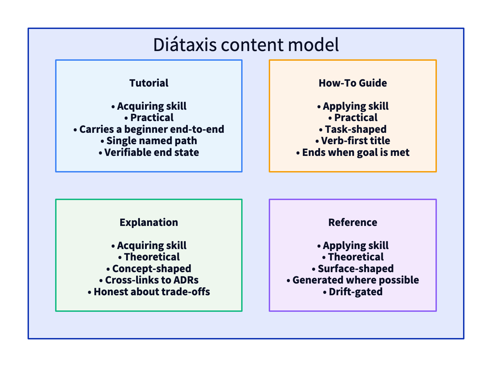
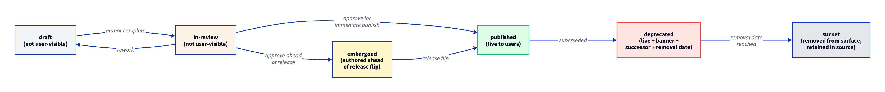
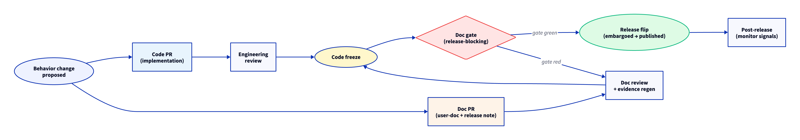

# Stribog User Documentation Standard

## 0. TL;DR

User documentation is a first-class system surface. Every Stribog project that exposes a human-operable surface — a UI, a CLI used by non-engineers, an API consumed by integrators who are not the implementers, a managed service, a public-facing artifact — ships user documentation built to the discipline in this standard. User documentation is structured by the Diátaxis content model, written to a declared audience, kept in lockstep with the shipped behavior, and treated as part of the release contract. A release that ships behavior without the matching user documentation update is not a complete release.

## 0.1 Why This Standard Exists

Reference-grade engineering documentation, declared by the [[Stribog Documentation Standard]], governs how Stribog projects document themselves to their own engineers and reviewers. It does not, on its own, govern what reaches the people who actually use Stribog software. The Documentation Standard names the public surface (§2.5) but does not prescribe its internal architecture, its evidence discipline, its lifecycle, its tone, or its release coupling.

This standard fills that gap. It defines the architecture, ownership, evidence requirements, and lifecycle of every artifact a Stribog project publishes to its users. It is the operative discipline for everything an end-user, operator, or integrator reads.

## 0.2 Applicability

This standard binds every Stribog project that ships a surface a human outside the implementation team will touch. That includes, without limitation:

- web applications, mobile applications, and desktop applications
- command-line tools used by operators, administrators, or end-users
- managed services with a customer-facing portal, console, or status page
- HTTP, gRPC, MCP, or SDK surfaces consumed by integrators who are not the implementers
- on-premise products, distributed binaries, container images, and Helm charts that downstream operators install and run
- public scripts, installers, and bootstrap surfaces

A project whose surfaces are exclusively internal to its own implementation team — for example, a private library consumed only by the same team that wrote it — declares that scope in its [[Charter Compliance Annex]] and is exempt from the user-facing clauses while remaining bound to the developer-facing clauses of the [[Stribog Developer Documentation Standard]].

## 0.3 Definitions

This standard relies on the [[Stribog Glossary]] for cross-cutting terms. User-documentation-specific terms used in this document:

- **Diátaxis quadrant:** one of the four orthogonal content modes — *tutorial*, *how-to guide*, *reference*, *explanation* — that together form a complete user-documentation surface. The quadrants are defined by two axes: the user is *acquiring skill* versus *applying skill*, and the content is *practical* versus *theoretical*.
- **User-facing release note:** a release note written for the audience that uses the software, not for the engineers who built it. Distinct from a producer-side changelog.
- **In-product help:** documentation that travels inside the running product — tooltip text, empty-state copy, error messages, inline hints, contextual help drawers, onboarding flows.
- **Support escalation map:** the named path a user follows when self-service documentation does not resolve their problem.
- **Doc-to-release sync:** the discipline that a documentation update for a behavior change lands on or before the release that ships the behavior.
- **Audience tier:** a declared category of reader — end-user, operator, administrator, integrator — for whom a document is primarily written.

## 1. Core Positions

The Stribog position on user documentation is:

1. **Documentation is part of the product.** A behavior that ships without its user documentation has not shipped; it has been leaked.
2. **The Diátaxis content model is canonical.** Every user-facing documentation surface is organized into the four Diátaxis quadrants. Mixed-quadrant pages are non-compliant.
3. **Audience is declared, not assumed.** Every user-facing document names the audience it is written for in front matter and in the opening paragraph.
4. **In-product help is documentation.** Tooltip copy, empty-state copy, error messages, and inline hints are governed by this standard, not by ad-hoc developer judgement.
5. **Release notes are written for users, not for engineers.** Producer-side changelogs do not satisfy the user-facing release-note requirement.
6. **Evidence is required.** Screenshots, console transcripts, and recorded interactions are first-class documentation artifacts and are versioned alongside prose.
7. **Documentation is owned.** Every user-facing surface has a named owner of record. Unowned documentation is non-compliant.
8. **The Charter Compliance Annex governs project-specific declarations.** The user-doc toolchain, locale set, audience tiers, and support escalation map are declared per-project in the annex.

## 2. Audience Model

A user-facing document declares the audience tier it primarily serves. Audience tiers are:

| Tier | Reader | Primary need |
|------|--------|--------------|
| **End-user** | A person using the product to accomplish their own task. May not be technical. | Confidence that the next click or command does what they intend. |
| **Operator** | A person running the product on behalf of others — installer, day-2 administrator, on-call engineer at a customer site. | Trust that a documented procedure will produce a known operational state. |
| **Administrator** | A person configuring tenancy, permissions, identity, or organisational policy. | Clarity about scope, blast radius, and reversibility of a configuration change. |
| **Integrator** | A person calling an exposed API, embedding an SDK, or writing a plugin against the product. | A working code path, a stable contract, and a clear deprecation posture. |
| **Evaluator** | A prospective adopter assessing fit. | An honest, scoped account of what the product does and does not do. |

A document may serve more than one tier, but it names the tiers explicitly and surfaces the per-tier guidance distinctly. Documents that drift between tiers without naming them are non-compliant.

The [[Charter Compliance Annex]] declares the audience tiers the project actively supports. A project that does not ship to integrators, for example, declares that and is exempt from the integrator-tier clauses of this standard.

## 3. Content Architecture — The Diátaxis Quadrants

Every user-facing documentation surface is organized into four orthogonal quadrants. Each quadrant has a distinct purpose, voice, and acceptance test.

### 3.1 Tutorial

A tutorial teaches a beginner a skill by walking them through a single, named, working scenario from a known starting state to a named end state. A tutorial is judged by whether a beginner who has never used the product can follow it, end-to-end, and arrive at the named end state without external help.

A tutorial:

- assumes nothing the reader has not been told
- names every prerequisite explicitly, including environment, account, and prior installation
- walks a single path; it does not branch or offer alternatives
- carries the reader; it does not require independent judgement
- ends at a verifiable end state the reader can observe

A tutorial does not:

- enumerate options
- explain concepts at length
- show several ways of doing the same thing
- assume the reader will improvise

### 3.2 How-To Guide

A how-to guide helps a competent user accomplish a real-world goal that maps onto a recognized task. A how-to guide is judged by whether a reader who already understands the product can use it to finish their actual task.

A how-to guide:

- names the goal in the title — verb-first, task-shaped
- assumes the reader already understands the underlying product concepts
- handles realistic preconditions and known variations
- ends when the goal is achieved, not when the page runs out

A how-to guide does not:

- teach
- explain
- summarize
- substitute for reference material

### 3.3 Reference

Reference documentation describes the product's surface — commands, flags, endpoints, configuration keys, error codes, exit codes, schema fields, permissions, limits. Reference is judged by completeness, accuracy, and freedom from drift.

Reference:

- is organized by the structure of the product surface, not by the reader's journey
- is exhaustive within its declared scope
- is generated, mirrored from source, or verified against source on every release
- contains no narrative

Reference does not:

- teach
- recommend
- editorialize
- omit fields for brevity

A project whose reference is generated from source — for example, a CLI's `--help` output, an OpenAPI spec, a JSON Schema — declares the generator and the drift-detection gate in the [[Charter Compliance Annex]] and in the [[Stribog Developer Documentation Standard]] §4 contract.

### 3.4 Explanation

Explanation documentation builds the reader's understanding of why the product is shaped the way it is — the concepts, the trade-offs, the boundaries with adjacent systems, the historical decisions that produced the current shape. Explanation is judged by whether a thoughtful reader leaves with a sharper model of the product than they arrived with.

Explanation:

- is concept-shaped, not task-shaped
- is written for the curious, the evaluator, and the engineer integrating against the product
- cross-links to the underlying [[Architecture Decision Record (ADR)]] family where the decisions are recorded
- is honest about trade-offs and explicit about what the product is not

Explanation does not:

- walk through a procedure
- enumerate flags
- substitute for reference
- restate marketing material

### 3.5 Quadrant Diagram

The four quadrants and their axes are illustrated in `diagrams/01-diataxis-quadrants.png`.

*The two axes — practical versus theoretical, and acquiring versus applying skill — produce the four Diátaxis quadrants. Each quadrant has a distinct purpose, voice, and acceptance test.*

### 3.6 Mixed-Quadrant Pages Are Non-Compliant

A page that begins as a tutorial and devolves into a flag enumeration, or a how-to guide that pauses to explain a concept at length, or a reference page that opens with a marketing summary, fails this standard. The cure is to split the page along quadrant lines and cross-link between the pieces.

## 4. Required Document Families per Project

Every Stribog project bound by this standard publishes the documentation families below. Where a family does not apply — for example, a project with no integrator audience does not ship an integrator how-to library — the [[Charter Compliance Annex]] declares the exemption and the reason.

### 4.1 Quickstart

A single named tutorial that takes a new user from a clean starting state to the smallest meaningful end state in the shortest defensible time. The quickstart is the project's promise to a new reader. A project without a working quickstart is not user-ready.

### 4.2 How-To Library

A library of task-shaped how-to guides covering the supported user goals. The library is organised by goal, not by feature. Each guide is owned, dated, and tied to a product version range.

### 4.3 User-Facing Reference

The complete reference surface for the audiences declared in the [[Charter Compliance Annex]]: CLI command and flag reference, configuration reference, error and exit code reference, schema reference for any user-edited configuration format. Engineer-facing reference — API, SDK, internal schema — lives under the [[Stribog Developer Documentation Standard]].

### 4.4 Conceptual Explanations

A small, deliberate library of explanation documents covering the concepts a user must hold in order to use the product well. Explanation is finite; a project does not aim for an exhaustive explanation library. Each explanation cross-links to the ADRs that produced the underlying decision.

### 4.5 Troubleshooting and FAQ

A troubleshooting library organised by *observable symptom*, not by internal cause. Each entry names the symptom, the likely causes ordered by frequency, the diagnostic steps, the remediation, and an escalation path. FAQ entries are derived from real, recurring user questions; a fabricated FAQ is non-compliant.

### 4.6 User-Facing Release Notes

A user-facing release note for every release that changes user-observable behavior. The note is written for the audience that uses the software. It is not a copy of the producer-side changelog. It states, in plain language, what changed, who is affected, what to do, and whether action is required.

A user-facing release note contains:

- the release identifier and date
- the affected audience tiers
- the user-visible changes grouped by audience tier
- any required action with a clear deadline
- any deprecation or removal, with the originally-announced timeline and the current state
- a link to the matching how-to or reference page for any non-trivial change

A release that ships user-observable behavior without a user-facing release note is non-compliant under §11.

### 4.7 Support Escalation Map

A published, dated document that names the path a user follows when self-service documentation does not resolve their problem. The map names channels, expected response posture, and the boundary between self-service and assisted support. An undefined or stale escalation map is non-compliant.

### 4.8 In-Product Help Surface

The catalogue of in-product strings — empty-state copy, tooltips, error messages, inline hints, onboarding microcopy — governed by §7 of this standard and by §6 of the [[Stribog UI/UX Standard]]. The surface is reviewable as a body of text, not only as in-context strings.

## 5. Voice, Tone, and Style for Users

User-facing documentation follows the prose discipline of the [[Stribog Documentation Standard]] §5 and adds the following user-facing rules.

### 5.1 Write to the Reader, Not About the Product

User documentation addresses the reader directly. The reader is the subject of the sentence; the product is the verb. Documentation that narrates the product's behavior in the third person, without ever naming the reader, fails this rule.

### 5.2 Lead With the Outcome

A page opens by stating what the reader will accomplish or learn. Setup, prerequisites, and rationale follow. A page that opens with prerequisites or with marketing-shaped framing fails this rule.

### 5.3 Plain Language

User documentation uses the simplest defensible word for the meaning. Terms of art are introduced only where the reader's task requires them, and only after a one-sentence introduction. The [[Stribog Glossary]] is referenced by link, not redefined inline.

### 5.4 Honesty About Limits

User documentation states, in the section where the limit applies, what the product does not do, what it does poorly, and where the reader should look for an alternative. Documentation that hides limits behind a polished surface is non-compliant.

### 5.5 No Marketing Voice in Reference or How-To

Reference and how-to documents are operationally voiced. Marketing voice — superlatives, value claims, comparative language — does not appear in reference or how-to documents. It is acceptable, in moderation, in explanation documents and on landing pages.

### 5.6 Forbidden Filler

The forbidden-filler list from the [[Stribog Documentation Standard]] §5.4 applies. The user-doc surface specifically forbids:

- *simply*, *just*, *easy*, *easily*, *effortlessly*
- *of course*, *naturally*, *obviously*
- *as you can see*, *as expected*
- imperative *please* in instructions

## 6. Evidence Discipline

User documentation carries evidence. Evidence is the screenshots, transcripts, recordings, and reproductions that anchor prose to reality.

### 6.1 Screenshots Are Versioned Artifacts

Every screenshot in the user-facing documentation surface is committed to the documentation source tree under a stable path. Screenshots embed a product version reference in their file name or in adjacent metadata. A screenshot that no longer matches the shipped UI triggers a documentation update.

### 6.2 Console Transcripts Are Reproducible

Console transcripts in user documentation are reproducible from a stated starting state. A transcript that the reader cannot reproduce because the starting state was undocumented or the inputs were synthesized is non-compliant.

### 6.3 Sensitive Data Does Not Appear in Evidence

Real user data, real API keys, real customer names, real internal hostnames, and real IP addresses do not appear in published evidence. The [[Stribog Data and Privacy Standard]] §6.4 governs the fixture discipline that produces safe evidence.

### 6.4 Animated and Video Evidence

Where a static screenshot cannot convey the interaction — a multi-step gesture, a transition, a complex error recovery — a short, captioned recording is acceptable. Recordings carry the same versioning and reproducibility discipline as screenshots.

### 6.5 Diagrams as Visual Evidence

User-facing documentation uses diagrams to anchor concepts, flows, lifecycles, and decision trees that prose alone explains poorly. Diagrams are governed by the rules below in addition to the project-wide [[Stribog Documentation Standard]] §7 diagram standard.

#### 6.5.1 D2 Is the Default for User Docs

Every diagram in the user-doc surface is authored in D2 using the installed `d2` skill or `d2` CLI on the authoring machine. Hand-drawn diagrams, screenshots of slide-tool exports, ASCII art in prose, and ad-hoc image-editor exports without a tracked source file are non-compliant. Sequence-shaped material that D2 expresses awkwardly may fall back to Mermaid, but the fallback is named in the project's annex and is not the default.

#### 6.5.2 Source and Rendered Output Are Both Committed

Every diagram is committed as three artifacts:

- the `.d2` source file under `diagrams/` adjacent to the document that embeds it
- the rendered `.svg` output for HTML and web surfaces
- the rendered `.png` output for PDF and preview surfaces

The user-facing documentation site embeds the rendered output; the source file is the artifact a future author edits. A diagram that ships without its source file is non-compliant.

#### 6.5.3 When a Diagram Is Required

A diagram is required where the underlying material is irreducibly structural and prose cannot convey it without ambiguity. The required-diagram set for the user-doc surface includes, at minimum:

- the high-level conceptual model of the product as the user sees it, in the explanation family
- any decision tree in the troubleshooting library that branches more than three ways
- any multi-step flow in the how-to library whose order is non-obvious from prose
- any lifecycle, state machine, or status vocabulary the user must reason about

#### 6.5.4 When a Diagram Is Forbidden

A diagram is forbidden where it adds visual cost without explanatory return. Specifically:

- a diagram that restates a two-row table
- a diagram that depicts only a single linear sequence prose handles well
- a diagram embedded for decorative purposes
- a screenshot of a third-party diagram tool's interface rather than a rendered output

#### 6.5.5 Accessibility of Diagrams

Diagrams carry alt text describing the diagram's content for assistive technology, per §8.4. A rendered diagram without alt text is non-compliant. Where the diagram conveys information no other artifact carries, an accessible prose summary accompanies the figure.

#### 6.5.6 Diagrams Are Diff-Reviewed

Because the `.d2` source is text, diagram changes are reviewed by source diff. A diagram updated only at the rendered-output layer, without a corresponding source-file change, is non-compliant — the source becomes stale.

## 7. In-Product Help and Error Messages

In-product strings are documentation. They are subject to this standard, are reviewed before release, and are owned.

### 7.1 Error Messages Are User Documentation

An error message tells the reader what happened, in their terms, and what to do next. An error message that exposes an internal exception class, an internal identifier, or a developer-grade stack trace to a non-engineer audience is non-compliant. The accompanying detail — log identifier, support reference — is acceptable as a secondary line.

The error message standard from the [[Stribog UI/UX Standard]] §6.2 applies to every error string that reaches a user.

### 7.2 Empty States Carry Onboarding Weight

The first screen a new user sees in a feature is often an empty state. Empty-state copy names what the reader is looking at, why it is empty, and the next action that will populate it. An empty state that says only "No items" is non-compliant.

### 7.3 Tooltip Discipline

A tooltip clarifies a control whose meaning is not obvious from its label. A tooltip that restates the label is non-compliant. A tooltip that carries critical action information that should have appeared in the visible label is also non-compliant — the cure is to fix the label, not to add a tooltip.

### 7.4 In-Product Strings Are Reviewable in Bulk

The in-product string catalogue is exportable from the source tree, reviewable as prose, and subject to the same tone and forbidden-filler rules as the rest of the user-doc surface.

## 8. Localization and Accessibility of Documentation

### 8.1 Source Language

The source language of the user-doc surface is declared in the [[Charter Compliance Annex]]. Source-language documents are the canonical record; localizations are derived.

### 8.2 Locale Set

The locales the project actively maintains are declared in the [[Charter Compliance Annex]]. A locale that drifts more than one product release behind the source language is flagged in the project's audit register and is either caught up or formally suspended.

### 8.3 Translation Process

The translation pipeline — translator (human or assisted), reviewer, fallback policy when a string is untranslated, glossary management — is declared in the annex. Machine-only translation without a human review step is acceptable only for locales declared *beta* in the annex and only where the reader is warned at the top of the localized surface.

### 8.4 Accessibility of the Documentation Surface Itself

The published documentation surface is itself an accessible surface. It conforms to the same WCAG 2.2 AA bar declared in the [[Stribog UI/UX Standard]] §4.1, including:

- semantic heading structure
- alt text on every image carrying content (decorative images carry empty alt)
- sufficient contrast in the rendered theme, including the dark theme where one is offered
- keyboard navigability of the documentation site
- caption tracks on video evidence

A documentation site that is itself inaccessible cannot be relied on as accessibility documentation, and is non-compliant.

## 9. Lifecycle and Status Vocabulary

User-facing documents follow the status vocabulary of the [[Stribog Documentation Standard]] §10, with the following user-doc-specific values added.

| Status | Meaning |
|--------|---------|
| `draft` | Authoring in progress. Not visible to users. |
| `in-review` | Authoring complete, pending review or evidence regeneration. Not visible to users. |
| `published` | Live to users. Bound to a stated product version range. |
| `deprecated` | Live to users, but superseded. Carries a banner naming the successor and the removal date. |
| `sunset` | No longer visible to users. Retained in the documentation source tree for traceability. |
| `embargoed` | Authored ahead of a release; published on the release date by the release process, not before. |

A user-facing document with no status, or with a status that does not match its visibility, is non-compliant.

The lifecycle is illustrated in `diagrams/02-user-doc-lifecycle.png`.

*A user-facing document moves through draft, in-review, embargoed, published, deprecated, and sunset. Every transition is traceable.*

## 10. Ownership and Review Cadence

### 10.1 Named Owner

Every user-facing document names an owner in front matter. The owner is the human or team accountable for the document's accuracy and lifecycle. An unowned user-facing document is non-compliant.

### 10.2 Review Cadence

| Document family | Minimum review cadence |
|-----------------|------------------------|
| Quickstart | Every release that changes the first-run path. |
| How-to guides | Every release that changes the underlying task. Annual freshness review otherwise. |
| Reference | Every release. Drift gate from generated source is the primary mechanism. |
| Explanation | Annual freshness review, or any time the underlying [[Architecture Decision Record (ADR)]] is superseded. |
| Troubleshooting and FAQ | Quarterly review against the support escalation channel for recurring topics. |
| Release notes | Per release. |
| In-product strings | Per release. |

A document whose `last_updated` field is older than its declared cadence allows is flagged in the project's audit register.

### 10.3 Stewardship Handoff

When the owner of a user-facing document changes — team reorganisation, contributor departure — the handoff is recorded in the document's revision history. A handoff that is not recorded is non-compliant.

## 11. Doc-to-Release Sync

Documentation for a behavior change lands *on or before* the release that ships the behavior.

### 11.1 Doc Gate at Release

The release process enforces a documentation gate. A release that changes user-observable behavior is blocked until the matching user-doc update is merged in a `published` or `embargoed` state. The [[Stribog Operational Delivery Standard]] §15.2 and the [[Universal Stribog Engineering Charter]] §12.4 require the doc-gate as part of release-level done.

### 11.2 The Embargo Path

Documentation for a feature under embargo is authored, reviewed, and merged in `embargoed` status ahead of the release. The release process flips the status to `published` at release time. Embargoed documents do not appear on the live surface until the release flip.

### 11.3 The Sync Timeline

The doc-to-release sync timeline is illustrated in `diagrams/03-doc-to-release-sync.png`.

*Documentation for a behavior change is authored alongside the change, reviewed before code-freeze, and either published or held in embargo until the release flip. A release without a matching documentation update is held.*

### 11.4 Operational Release Path

For projects whose delivery model is operational rather than versioned — managed services, rolling deployments — the [[Stribog Operational Delivery Standard]] §15 governs. The doc-gate applies to every operational change that shifts user-observable behavior; the change record names the documentation artifact updated.

## 12. Measurement

User documentation is measured. Measurement informs the next cycle of authoring effort.

### 12.1 Required Signals

The minimum measurement surface includes:

- per-page traffic on the published documentation site, retained for at least the current release cycle
- support-ticket-to-documentation linkage: each closed support ticket that documents a recurring user question links to the documentation page that would have answered it, or names the missing page
- search-term log on the published documentation site, where the toolchain supports it
- in-product help engagement (tooltip open, contextual help drawer open) where the runtime supports it

### 12.2 Privacy Posture for Documentation Telemetry

Documentation site analytics conform to the [[Stribog Data and Privacy Standard]] and the consent rules in the [[Stribog UI/UX Standard]] §11. Documentation telemetry does not silently track identifiable users.

### 12.3 Action on Signal

A measurement signal — a page with no traffic, a search term with no result, a recurring ticket pattern — triggers an authoring response in the next cycle. Measurement that does not produce action is theater and is non-compliant.

## 13. User Documentation Definition of Done

A user-doc artifact is done when:

- it is in the correct Diátaxis quadrant
- it declares its audience tier(s) in front matter and in its opening paragraph
- it carries evidence proportional to its quadrant — screenshots and transcripts for tutorial and how-to, generated mirrors for reference, conceptual diagrams or cross-links to ADRs for explanation
- it passes the tone and forbidden-filler rules of §5
- it cross-links to the [[Stribog Glossary]] for any term of art it relies on
- it has a named owner and a `status` that matches its visibility
- it is reachable from the project's documentation index in at most two clicks
- it is referenced from the release-note entry that introduced or last changed the underlying behavior
- it conforms to the accessibility bar of §8.4

A user-facing release is done when:

- every behavior-change documentation update for the release is merged in `published` or `embargoed` status
- the release-note entry exists and names every affected audience tier
- the support escalation map is current
- in-product strings introduced or changed in the release have passed the §7 review
- the localization surface is either updated or formally noted as deferred per §8.2

## 14. Anti-Patterns

The following are forbidden under this standard. Each anti-pattern names a category; the [[Stribog Documentation Standard]] §13 anti-patterns also apply.

- **Tutorial-as-reference.** A tutorial used as the primary surface for flag or option enumeration.
- **Reference-as-tutorial.** A reference page that tries to teach a beginner.
- **The hidden flag.** A user-visible CLI flag or configuration key that is not documented in the reference surface.
- **The leaked exception.** An internal exception class or stack trace surfaced as an error message to an end-user audience.
- **The Lorem ipsum FAQ.** An FAQ assembled from speculation rather than from real recurring user questions.
- **The phantom feature.** Documentation for a feature that has not shipped, or that shipped behind an undocumented flag, written as though the feature is generally available.
- **The marketing reference.** A reference page that opens with value-claim prose before the surface it documents.
- **The frozen screenshot.** A screenshot from a prior version still embedded in documentation for the current version.
- **The orphan release note.** A release note that names a change but does not link to the matching documentation update.
- **The translator-machine layer.** A locale that is fully machine-translated, not declared *beta*, and not warned about to the reader.
- **The unowned page.** A user-facing page with no named owner.
- **The unsynced gate.** A release that ships user-observable behavior without the documentation gate having held.
- **The escalation cul-de-sac.** A support escalation map that terminates in a channel that does not respond.
- **The accessibility-blind doc site.** A documentation surface that fails the same WCAG bar it asks the product to meet.

## 15. Revision History

| Version | Date | Author | Notes |
|---------|------|--------|-------|
| 1.0.0 | 2026-05-12 | stribog-team | Initial issuance. Establishes user-facing documentation as a binding system surface. Introduces the Diátaxis content architecture, the audience tier model, the doc-to-release sync gate, and the in-product help governance contract. Created alongside the [[Stribog Developer Documentation Standard]] and the [[Stribog UI/UX Standard]] as a coordinated three-document expansion of the charter set governing user-facing surfaces. Filed in response to Charter Set Audit Round 6 finding F62 (User Documentation, Developer Documentation, and UI/UX absent from the charter set). Cross-references added to the [[Stribog Documentation Standard]] §2, [[Universal Stribog Engineering Charter]] §6, [[Stribog Operational Delivery Standard]] §15, [[Charter Governance]] §2, [[Stribog Glossary]], and the [[Charter Compliance Annex]] template in the same revision cycle. |
